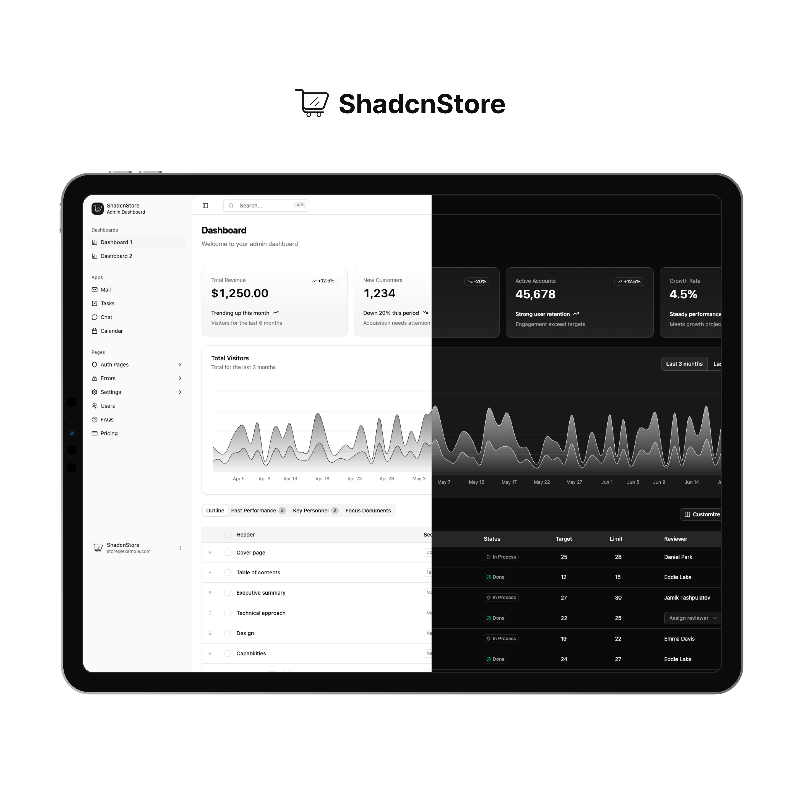

# Pathfinder — Next.js Client

[](https://www.typescriptlang.org/)
[](https://reactjs.org/)
[](https://nextjs.org/)
[](https://tailwindcss.com/)



Modern admin dashboard + landing page client built with **Next.js 16**, **React 19**, **TypeScript**, **shadcn/ui v3** và **Tailwind CSS v4**. Đã được tinh gọn, chỉ còn Next.js (bản Vite đã được loại bỏ).

---

## ✨ Tech Stack

- **Next.js 16** — App Router, server components
- **React 19** — Concurrent features
- **TypeScript** — Full type safety
- **shadcn/ui v3** + **Radix UI** — Component library
- **Tailwind CSS v4** — Utility-first styling
- **tweakcn** — Theme customization
- **Lucide React** — Icons
- **Zustand** — State management
- **React Hook Form** + **Zod** — Forms & validation
- **TanStack Table** — Data tables
- **Recharts** — Charts

---

## 🚀 Quick Start

### Prerequisites

- **Node.js** 18+
- **pnpm** (recommended), npm hoặc yarn

### Install & Run

```bash
cd client
pnpm install
pnpm dev
```

Truy cập tại: <http://localhost:3000>

---

## 🛠️ Scripts

```bash
pnpm dev      # Start dev server (Next.js)
pnpm build    # Production build
pnpm start    # Run production server
pnpm lint     # Lint với eslint-config-next
```

---

## 🏗️ Project Structure

```text
📁 client/
├── 📁 public/                    # Static assets
├── 📁 src/
│   ├── 📁 app/                   # Next.js App Router
│   │   ├── 📁 (auth)/            # Auth route group
│   │   │   ├── login/
│   │   │   ├── signup/
│   │   │   ├── forgot-password/
│   │   │   └── errors/
│   │   ├── 📁 (dashboard)/       # Dashboard route group
│   │   │   ├── dashboard/
│   │   │   ├── dashboard-2/
│   │   │   ├── mail/
│   │   │   ├── tasks/
│   │   │   ├── chat/
│   │   │   ├── calendar/
│   │   │   ├── settings/
│   │   │   ├── users/
│   │   │   ├── faqs/
│   │   │   └── pricing/
│   │   ├── 📁 landing/           # Landing page
│   │   ├── layout.tsx
│   │   ├── loading.tsx
│   │   ├── not-found.tsx
│   │   └── page.tsx
│   ├── 📁 components/            # UI & layout components
│   │   ├── ui/                   # shadcn/ui v3
│   │   ├── layouts/
│   │   └── theme-customizer/
│   ├── 📁 hooks/
│   ├── 📁 lib/
│   └── 📁 types/
├── 📁 docs/                      # VitePress documentation site
├── components.json               # shadcn/ui config
├── next.config.ts
├── tsconfig.json
├── eslint.config.mjs
├── postcss.config.mjs
└── package.json
```

---

## 🎨 Theme Customization

Built-in **live theme customizer** (powered by tweakcn) cho phép đổi màu, layout sidebar, dark/light mode trực tiếp trong app.

### Themes có sẵn

- 🌊 Default · 🌙 Dark · 🌸 Rose · 🌿 Green · 🌅 Orange · 🔴 Red · 💜 Violet

### Custom CSS variables (`globals.css`)

```css
:root {
  --primary: oklch(0.5 0.2 240);
  --primary-foreground: oklch(0.98 0.02 240);
}

.dark {
  --primary: oklch(0.7 0.2 240);
  --primary-foreground: oklch(0.15 0.02 240);
}
```

### Gỡ bỏ Theme Customizer

1. Xoá `src/components/theme-customizer.tsx`
2. Xoá nút mở customizer khỏi `src/app/layout.tsx`
3. Xoá thư mục `src/components/theme-customizer/` (nếu có)

Tham khảo thêm: [shadcn/ui theming guide](https://ui.shadcn.com/docs/theming).

---

## 📋 Bao gồm

### Dashboard
- 2 dashboard variants (Overview & Analytics)
- Mail, Tasks, Chat, Calendar, Users apps
- 30+ pages: Auth, Settings, Errors, FAQ, Pricing
- Advanced data tables (sort/filter/pagination)
- Charts (Recharts)

### Authentication
- Login (3 variants), Sign Up (3 variants), Forgot Password (3 variants)

### Settings & Profile
- Account, Appearance, Notifications, Connections, Plans & Billing

### Error Pages
- 401, 403, 404, 500, Maintenance

### Landing Page
- Hero, About, Features, Stats, Logo carousel, Team, Testimonials, Blog, Pricing, FAQ, Contact, CTA, Nav & Footer

---

## 📄 License

MIT — xem [License.md](./License.md).

Template gốc: [shadcn-dashboard-landing-template](https://github.com/silicondeck/shadcn-dashboard-landing-template) bởi [ShadcnStore](https://shadcnstore.com).
