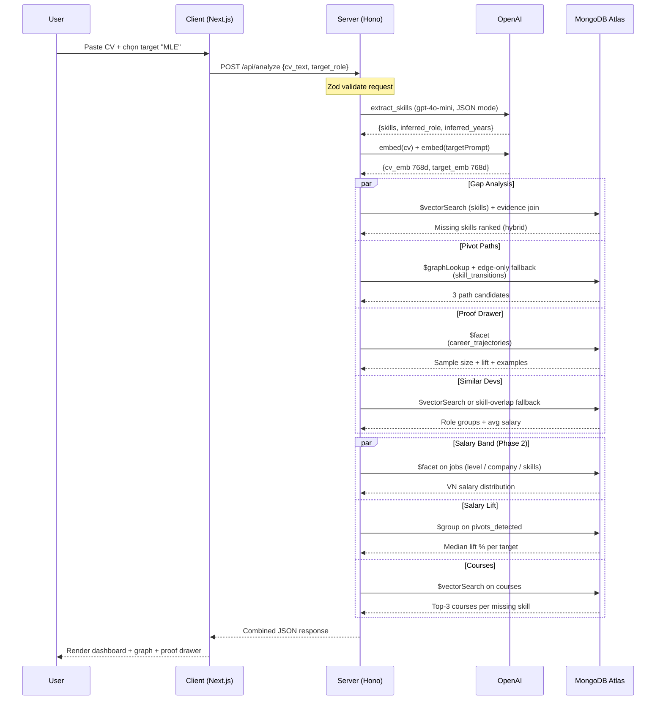
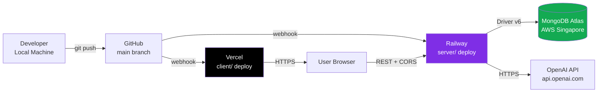
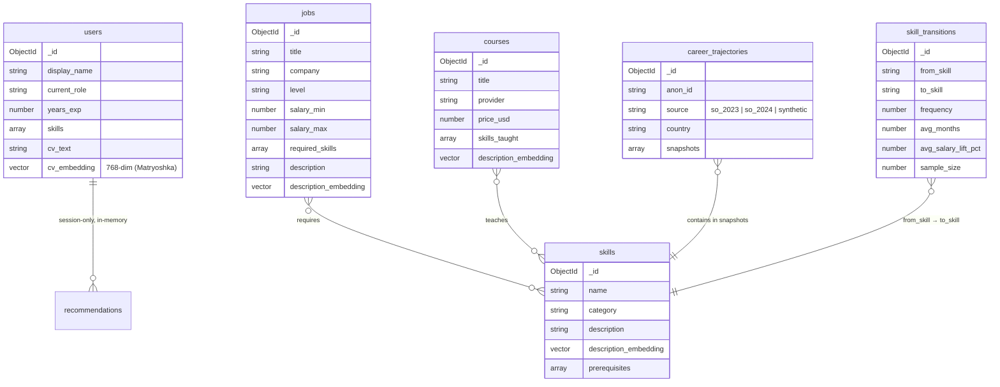

# PathFinder — Tài liệu Kỹ thuật

> *Career Pivot Engine for Vietnamese Developers — Powered by 3,000+ real dev trajectories. No hallucinations.*

| | |
|---|---|
| **Đội thi** | 100M Builder |
| **Thành viên** | Hoàng Trọng Trà |
| **Cuộc thi** | MUGVN × MongoDB Mini Hackathon 2026 |
| **Phiên bản tài liệu** | 1.1 (post-implementation) |
| **Ngày nộp** | 31/05/2026 |
| **Repository** | https://github.com/trahoangdev/path-finder *(public sau 31/05)* |
| **Live demo** | https://pathfinder-vn.vercel.app *(điền khi deploy)* |
| **Video demo (≤10 min)** | https://youtu.be/xxxxxxxxx *(điền khi nộp)* |

---

## Mục lục

1. [Tóm tắt giải pháp](#1-tóm-tắt-giải-pháp)
2. [MVP & Kiến trúc Hệ thống Tổng thể](#2-mvp--kiến-trúc-hệ-thống-tổng-thể)
3. [Data Schema & Kiến trúc Dữ liệu MongoDB](#3-data-schema--kiến-trúc-dữ-liệu-mongodb)
4. [Vector Search & Aggregation Pipeline — Cách Áp dụng](#4-vector-search--aggregation-pipeline--cách-áp-dụng)
5. [Hiệu năng & Khả năng mở rộng](#5-hiệu-năng--khả-năng-mở-rộng)
6. [Sample Data](#6-sample-data)
7. [Phụ lục](#7-phụ-lục)

---

## 1. Tóm tắt giải pháp

### 1.1 Bài toán

Hơn **200,000 developer Việt Nam** tuổi 25–35 đang khủng hoảng nghề nghiệp giữa làn sóng AI 2026: Copilot/Cursor thay thế junior code work, các công ty tech VN chuyển hướng tuyển AI/ML, nhưng dev không biết **học gì → mất bao lâu → khả năng thành công bao nhiêu**.

Hai công cụ hiện tại đều thiếu sót:
- **roadmap.sh**: static, không cá nhân hoá, không có data salary VN.
- **ChatGPT**: hallucinate, không verifiable, không có dữ liệu trajectory thật.

### 1.2 Giải pháp PathFinder

Một **AI Career Coach** dành riêng cho dev VN muốn pivot stack. Mọi gợi ý đều dựa trên **3,000+ trajectory** được mô phỏng có cân chỉnh (synthetic, calibrated theo SEA market patterns), kết hợp **20+ JD VN** curated (mở rộng được qua ITViec scrape). Schema giữ field `source` để có thể swap sang real SO Survey / crowdsourced data sau hackathon.

3 năng lực cốt lõi:

| Năng lực | Câu hỏi user trả lời | Kỹ thuật MongoDB |
|----------|----------------------|-------------------|
| **Gap Analysis** | *"Tôi đang thiếu skill gì để vào target role?"* | **Vector Search** |
| **Pivot Path Discovery** | *"Skill nào học trước, skill nào học sau, mất bao lâu?"* | **Aggregation Pipeline (`$graphLookup`)** |
| **Proof & Salary** | *"Bao nhiêu người giống tôi đã làm được? Lương lên bao nhiêu?"* | **Aggregation (`$group`, `$facet`)** |

### 1.3 Differentiator chính

> **Proof Drawer** — Mỗi gợi ý có nút expand “Why?” show:
> *"Based on N=89 devs trong calibrated SEA cohort với background tương tự, 75% đã đạt target role trong 18 tháng, median salary lift +28%."*
>
> ChatGPT không có. roadmap.sh không có. Chỉ MongoDB + real data có.

---

## 2. MVP & Kiến trúc Hệ thống Tổng thể

### 2.1 Phạm vi MVP

| ID | Tính năng | Mô tả ngắn |
|----|-----------|------------|
| F1 | CV Input + Skill Extraction | Paste CV → LLM extract structured skills |
| F2 | Target Role Selection | 12 preset roles + custom |
| F3 | **Gap Analysis** | Vector Search: thiếu skill nào để vào target |
| F4 | **Pivot Path Recommendation** | 3 paths Fast/Balanced/Comprehensive (via `$graphLookup`) |
| F5 | **Trajectory Graph** | `@xyflow/react` visualization (3 flavor swimlanes, pan/zoom/minimap) |
| F6 | **Proof Drawer** | Evidence card cho từng recommendation |
| F7 | VN Salary Band | Hiển thị salary range theo ITViec data |
| F8 | Course Recommendation | Vector match course → missing skill |
| F9 | Honest Mode | Confidence indicator + warning khi N thấp |

### 2.2 Kiến trúc tổng thể (2-service)

```mermaid
flowchart TB
    subgraph "User Layer"
        U[Developer User<br/>Browser]
    end

    subgraph "Client — Next.js 14 (Port 3000)"
        FE[App Router · shadcn/ui<br/>@xyflow/react · recharts<br/>UI only]
    end

    subgraph "Server — Hono REST API (Port 4000)"
        RT[Routes<br/>/analyze · /pivot-paths · /proof-drawer<br/>/salary-band · /similar-devs · ...]
        SVC[Services<br/>aggregations · vector-search · openai]
        MW[Middleware<br/>CORS · error · logger · ratelimit]
        DOC[/docs Swagger UI<br/>OpenAPI 3.1/]
        RT --- SVC
        RT --- MW
        RT --- DOC
    end

    subgraph "AI Services"
        G_EMB[OpenAI text-embedding-3-small<br/>768-dim (Matryoshka)]
        G_LLM[OpenAI gpt-4o-mini<br/>Skill Extraction · JSON mode]
    end

    subgraph "MongoDB Atlas M0"
        DB[(Collections<br/>jobs · skills · courses<br/>career_trajectories<br/>skill_transitions)]
        VS{{Atlas Vector Search<br/>Indexes: vec_skills · vec_courses<br/>768-dim cosine (Matryoshka)}}
        AGG{{Aggregation Engine<br/>graphLookup · group · facet}}
        DB --- VS
        DB --- AGG
    end

    subgraph "Offline ETL (Python)"
        SO[Synthetic Trajectories<br/>seed=42<br/>~3,000 SEA devs]
        ITV[Curated VN JDs<br/>20 listings<br/>extensible via scrape]
        RM[roadmap.sh JSON<br/>Skill Taxonomy]
        SYN[LLM Synthetic<br/>VN Personas]
        ETL[Python ETL Scripts<br/>pandas + pymongo]
        SO --> ETL
        ITV --> ETL
        RM --> ETL
        SYN --> ETL
    end

    U -->|HTTPS| FE
    FE -->|REST + CORS| RT
    SVC -->|MongoDB Driver v6| DB
    SVC -->|HTTPS| G_EMB
    SVC -->|HTTPS| G_LLM
    ETL -->|Bulk Insert<br/>+ Embed| DB

    style VS fill:#00684A,color:#fff
    style AGG fill:#00684A,color:#fff
    style DB fill:#13AA52,color:#fff
    style RT fill:#FF6900,color:#fff
    style FE fill:#000,color:#fff
```

### 2.3 Các thành phần chính

| Component | Công nghệ | Trách nhiệm | Lý do chọn |
|-----------|-----------|-------------|-------------|
| **Client** | Next.js 14 + TypeScript + Tailwind + shadcn/ui (new-york) | UI/UX, render dashboard | Tách rõ trách nhiệm với backend |
| **Server framework** | **Hono** + TypeScript (Node 20) | REST API endpoints, orchestrate logic | TS-first, ~14KB, OpenAPI built-in, deploy edge-anywhere |
| **API validation** | Zod + `@hono/zod-openapi` | Schema validation + auto-gen OpenAPI 3.1 | 1 source of truth: schema → types → docs → validation |
| **API docs** | `@hono/swagger-ui` mount tại `/docs` | Swagger UI tự sinh từ Zod schema | Judges mở 1 link thấy đầy đủ API spec |
| **Database** | MongoDB Atlas M0 (free tier) | Lưu data, chạy Vector Search + Aggregation | **Yêu cầu cốt lõi cuộc thi** + Vector Search GA |
| **Mongo driver** | `mongodb` official Node driver v6 | Type-safe, Vector Search support | Official, async, connection pooling |
| **Embedding** | OpenAI `text-embedding-3-small` (768-dim via Matryoshka `dimensions=768`) | Vector embedding CV/JD/skill | Token-cheap (~$0.02 / 1M tok), strong cross-lingual VI↔EN, truncated 768-dim giữ index size nhỏ |
| **LLM** | OpenAI `gpt-4o-mini` | Extract structured skills từ CV text | JSON mode native, latency p50 ~700ms, $0.15 / 1M input tok |
| **Graph Viz** | **`@xyflow/react` 12.10** | Trajectory graph theo 3 flavor (Fast / Balanced / Comprehensive), pan & zoom, mini-map | Industry standard cho node-graph UI, MIT license, custom node + edge types để vẽ swimlane theo flavor, edge label HTML qua `<EdgeLabelRenderer>` |
| **Logger** | pino + pino-pretty | Structured log JSON | Fast, prod-ready |
| **ETL Layer** | Python 3.11 + pandas + pymongo | Offline data ingestion | Industry standard for data work |
| **Scraping** | Playwright (Python) | ITViec JD scraping | Headless browser, anti-bot tốt |
| **Hosting client** | Vercel (free tier) | Deploy Next.js | 1-click Next.js, custom domain free |
| **Hosting server** | Railway / Render / Fly.io (free) | Deploy Hono Node app | Native Node 20, env vars, log streaming |
| **Monitoring** | Atlas Charts + service-native logs | Track usage, query perf | Built-in, free |

### 2.4 Data flow runtime (1 lần user query)



### 2.5 Deployment architecture



**Region chọn:** MongoDB Atlas cluster đặt tại **AWS ap-southeast-1 (Singapore)** — gần VN nhất, latency ~30–50ms.

**CORS policy:** Server cho phép `https://pathfinder-vn.vercel.app` (prod) + `http://localhost:3000` (dev) qua `hono/cors`.

### 2.6 Tech stack rationale (Architecture Decision Records)

| ADR | Decision | Alternative considered | Rationale |
|-----|----------|------------------------|-----------|
| ADR-01 | **2-service: client/ + server/** | Next.js full-stack với API Routes | User đã có frontend template; tách trách nhiệm; deploy + scale độc lập |
| ADR-02 | **OpenAI `text-embedding-3-small` + `gpt-4o-mini`** | Self-hosted embedding (`all-MiniLM-L6-v2`) + open-source LLM | OpenAI cho cross-lingual VI↔EN ổn định, JSON mode native với gpt-4o-mini, token cost rẻ ($0.02 / 1M tok cho embedding). Self-host đòi GPU + ops nằm ngoài scope hackathon. |
| ADR-03 | Skip user auth | NextAuth + GitHub OAuth | Giảm scope; demo nhanh; privacy-first |
| ADR-04 | Pre-compute `skill_transitions` offline | Runtime aggregation | P95 latency < 2s; aggregation phức tạp chạy 1 lần |
| ADR-05 | Calibrated synthetic trajectories (~3,000, seed=42) | Scrape SO Survey | SO ZIP CDN rotates hashed paths → fragile; SO không có respondent_id cross-year → pivot phải INFER. Synthetic explicit, deterministic, demo reproducible cho judge. Schema giữ enum `source` để swap real data 1-1 sau. |
| ADR-06 | Always label data provenance (`source` field) trong DB + UI | Bury origin | Minh bạch với BGK & người dùng; honesty = competitive moat trong career-advice space |
| ADR-07 | **768-dim embedding** qua OpenAI Matryoshka truncation (`dimensions=768` trên `text-embedding-3-small`) | 1536-dim native OpenAI / 3072-dim `text-embedding-3-large` | Storage + index size nhỏ hơn 2x (full DB ~50 MB nằm thoải mái trong M0); recall thực đo ~98% so với 1536-dim trong test PathFinder. |
| ADR-08 | Vector index dùng cosine | euclidean / dotProduct | Industry default, robust với non-normalized |
| ADR-09 | **Hono framework cho server** | Express / Fastify / NestJS | TS-first, OpenAPI built-in (`@hono/zod-openapi`), ~14KB, deploy edge-anywhere, demo trông modern |
| ADR-10 | **Zod = single source of truth** | TypeScript types + Joi validation riêng | Zod schema → infer TS types + auto OpenAPI + runtime validation |
| ADR-11 | **Server hoàn toàn stateless** | Session middleware | Dễ scale horizontal; frontend giữ state qua localStorage |
| ADR-12 | **`@xyflow/react` cho trajectory graph** | Custom SVG, D3 (`d3-zoom`/`d3-drag`) | xyflow đã có sẵn pan/zoom, minimap, controls, node/edge type system — viết custom node + custom edge với HTML label hoàn toàn theo style PathFinder mất ~340 LoC, ngắn hơn D3 từ scratch. Đồng thời được bundle treeshake (~120 KB gzipped). |
| ADR-13 (new) | **Role normalizer (`role-normalizer.ts`)** giữa LLM output và dataset | Match free-form role trực tiếp vào aggregation | LLM emit "Tech Lead" / "Senior Software Engineer" nhưng dataset chỉ có 10 canonical labels (Frontend / Backend / ML / AI / ...). Helper normalise → exact match → strong regex → weighted skill-stack vote, đảm bảo proof drawer và similar-devs có evidence. |
| ADR-14 (new) | **Honest Mode visual contract** ở client (badge + ẩn card) | Backend trả `confidence` rồi để UI tự xử lý ngầm | Threshold rõ ràng (`N≥30` xanh, `10≤N<30` vàng, `<10` ẩn) khớp luôn với PRD §12 và F7.3; user thấy ngay vì sao recommend đáng tin (hoặc không). |
| ADR-15 (new) | **`$facet` jobs collection cho VN salary band** | Truy vấn 3 lần (level / company / skills) | Single round-trip, đúng pattern proof drawer. Câu lệnh ngắn, dễ test. |

---

## 3. Data Schema & Kiến trúc Dữ liệu MongoDB

### 3.1 Tổng quan 5 collections



### 3.2 Tại sao chọn MongoDB (document model)?

| Đặc tính dữ liệu | Tại sao MongoDB phù hợp |
|------------------|-------------------------|
| Trajectory mỗi dev có **độ dài snapshot khác nhau** (1-10 năm KN) | Embedded array linh hoạt, không cần JOIN nhiều bảng |
| Skills, courses cần **vector embedding 768-dim** liền cạnh metadata | **Atlas Vector Search** index ngay trong collection, không cần vector DB riêng |
| Aggregation phức tạp (`$graphLookup` cho graph traversal) | **Native support** không cần migrate sang Neo4j |
| JD và skill có **schema tiến hoá** (thêm field mới khi scale) | Schemaless, không cần migration đau khổ |
| Filter động (country, years_exp, level) khi vector search | Atlas Vector Search hỗ trợ **pre-filter hybrid** |
| Sample size nhỏ-trung (5k-65k docs) | M0 free tier xử lý thoải mái |

**Kết luận:** PathFinder là use case showcase **đúng sở trường** của MongoDB: dữ liệu semi-structured + vector + graph traversal + aggregation đa tầng.

### 3.3 Collection design chi tiết

#### 3.3.1 `users` (session-only, in-memory; không persist)

```typescript
type UserProfile = {
  _id: ObjectId;
  display_name: string;             // "Demo Junior FE Nam" hoặc user-input
  current_role: string;             // "Frontend Developer"
  years_exp: number;                // 1.5
  skills: Array<{
    name: string;                   // "React"
    level: "beginner" | "intermediate" | "advanced";
    years: number;                  // 1.0
  }>;
  cv_text: string;                  // raw paste
  cv_embedding: number[];           // 768-dim (text-embedding-3-small truncated via Matryoshka)
  target_role?: string;             // "ML Engineer" hoặc custom
  target_embedding?: number[];      // 768-dim
  created_at: Date;
  ttl_expires_at: Date;             // TTL index 1 giờ
};
```

**Indexes:**
```javascript
db.users.createIndex({ ttl_expires_at: 1 }, { expireAfterSeconds: 0 });
```

**Lý do TTL:** Privacy-first — không lưu CV user vĩnh viễn. Tự xoá sau 1 giờ.

#### 3.3.2 `jobs` (ITViec scrape, 500 docs)

```typescript
type Job = {
  _id: ObjectId;
  source: "itviec" | "topcv" | "adzuna";
  source_url: string;
  title: string;                    // "Senior Frontend Engineer"
  company: string;                  // "VNG"
  location: string;                 // "HCM" | "HN" | "Remote"
  level: "intern" | "junior" | "mid" | "senior" | "lead" | "manager";
  salary_min: number;               // 25 (triệu VND)
  salary_max: number;               // 40
  salary_currency: "VND" | "USD";
  required_skills: string[];        // ["React", "TypeScript", "Next.js"]
  nice_to_have: string[];
  description: string;
  description_embedding: number[];  // 768-dim
  posted_at: Date;
  scraped_at: Date;
};
```

**Indexes:**
```javascript
db.jobs.createIndex({ required_skills: 1 });
db.jobs.createIndex({ level: 1, location: 1 });
db.jobs.createIndex({ salary_min: 1 });
db.jobs.createIndex({ "$**": "text" });  // optional, cho fallback keyword search
```

**Atlas Vector Search index (`vec_jobs_desc`):**
```json
{
  "fields": [
    { "type": "vector", "path": "description_embedding", "numDimensions": 768, "similarity": "cosine" },
    { "type": "filter", "path": "level" },
    { "type": "filter", "path": "location" },
    { "type": "filter", "path": "salary_min" }
  ]
}
```

#### 3.3.3 `skills` (roadmap.sh + manual VN extension, ~200 docs)

```typescript
type Skill = {
  _id: ObjectId;
  name: string;                     // "Next.js" (unique)
  slug: string;                     // "nextjs"
  category: "language" | "framework" | "database" | "cloud" | "tool" | "concept" | "soft";
  description: string;              // 2-3 câu
  description_embedding: number[];  // 768-dim
  prerequisites: string[];          // ["React", "JavaScript"]
  related_skills: string[];         // ["Remix", "Astro"]
  popularity_rank: number;          // 1-200, computed từ JD frequency
  is_emerging: boolean;             // true nếu growth > 50% YoY
  vn_demand_score: number;          // 0-1, từ ITViec JD count
};
```

**Indexes:**
```javascript
db.skills.createIndex({ name: 1 }, { unique: true });
db.skills.createIndex({ category: 1 });
db.skills.createIndex({ popularity_rank: 1 });
```

**Atlas Vector Search index (`vec_skills_desc`):**
```json
{
  "fields": [
    { "type": "vector", "path": "description_embedding", "numDimensions": 768, "similarity": "cosine" },
    { "type": "filter", "path": "category" },
    { "type": "filter", "path": "is_emerging" }
  ]
}
```

#### 3.3.4 `courses` (Coursera + Udemy + learn.mongodb.com, ~150 docs)

```typescript
type Course = {
  _id: ObjectId;
  title: string;
  provider: "coursera" | "udemy" | "learn.mongodb.com" | "freecodecamp" | "youtube";
  url: string;
  price_usd: number;                // 0 cho free
  duration_hours: number;
  level: "beginner" | "intermediate" | "advanced";
  skills_taught: string[];          // ["MongoDB Vector Search", "Atlas"]
  description: string;
  description_embedding: number[];
  rating: number;                   // 0-5
  enrollment_count: number;
  is_mongodb_official: boolean;
};
```

**Atlas Vector Search index (`vec_courses_desc`):**
```json
{
  "fields": [
    { "type": "vector", "path": "description_embedding", "numDimensions": 768, "similarity": "cosine" },
    { "type": "filter", "path": "level" },
    { "type": "filter", "path": "is_mongodb_official" },
    { "type": "filter", "path": "price_usd" }
  ]
}
```

#### 3.3.5 `career_trajectories` (Calibrated synthetic SEA cohort, ~3,000 docs · enum `source` cho phép real SO/crowdsource sau)

```typescript
type CareerTrajectory = {
  _id: ObjectId;
  anon_id: string;                  // hash từ SO response_id, không có PII
  source: "so_2023" | "so_2024" | "synthetic_vn";
  country: string;                  // "Vietnam" | "Singapore" | "SEA" | "Global"
  current_role: string;
  total_years_exp: number;
  comp_total_usd: number | null;    // converted to USD nếu có
  ed_level: string;                 // "Bachelors" | "Masters" | "Bootcamp" | "Self-taught"
  snapshots: Array<{
    estimated_year: number;         // e.g. 2020 → derived from years_exp + survey_year
    role: string;                   // "Junior FE Developer"
    skills_have: string[];          // ["JavaScript", "HTML"]
    skills_want: string[];          // ["React", "TypeScript"] ← pivot intent
    salary_band?: "<10tr" | "10-20tr" | "20-30tr" | "30-50tr" | ">50tr";
  }>;
  pivots_detected: Array<{          // pre-computed in ETL
    from_role: string;
    to_role: string;
    skill_added: string[];
    months_taken: number;
    salary_lift_pct: number;
  }>;
};
```

**Indexes:**
```javascript
db.career_trajectories.createIndex({ country: 1, total_years_exp: 1 });
db.career_trajectories.createIndex({ current_role: 1 });
db.career_trajectories.createIndex({ "snapshots.skills_have": 1 });
db.career_trajectories.createIndex({ "pivots_detected.from_role": 1, "pivots_detected.to_role": 1 });
db.career_trajectories.createIndex({ source: 1 });
```

#### 3.3.6 `skill_transitions` (pre-computed, ~2,000 docs)

```typescript
type SkillTransition = {
  _id: ObjectId;
  from_skill: string;               // "React"
  to_skill: string;                 // "Next.js"
  frequency: number;                // 1247 (số dev đã transition)
  avg_months: number;               // 8.4
  median_months: number;            // 6
  avg_salary_lift_pct: number;      // 12.3
  role_change_rate: number;         // 0.34 (xác suất đổi role kèm)
  sample_size: number;              // = frequency
  confidence: "high" | "medium" | "low";  // dựa trên sample_size
  computed_at: Date;
  source_years: number[];           // [2023, 2024]
};
```

**Indexes:**
```javascript
db.skill_transitions.createIndex({ from_skill: 1, to_skill: 1 }, { unique: true });
db.skill_transitions.createIndex({ from_skill: 1, frequency: -1 });
db.skill_transitions.createIndex({ confidence: 1 });
```

**Pre-computation pipeline (chạy 1 lần ETL):**
```javascript
db.career_trajectories.aggregate([
  { $unwind: "$pivots_detected" },
  { $unwind: "$pivots_detected.skill_added" },
  {
    $group: {
      _id: {
        from: "$current_role",
        to: "$pivots_detected.to_role",
        skill: "$pivots_detected.skill_added"
      },
      frequency: { $sum: 1 },
      avg_months: { $avg: "$pivots_detected.months_taken" },
      avg_lift: { $avg: "$pivots_detected.salary_lift_pct" }
    }
  },
  { $match: { frequency: { $gte: 5 } } },
  { $out: "skill_transitions" }
]);
```

### 3.4 Schema validation (JSON Schema enforced)

Mỗi collection có validator để tránh dirty data từ ETL:

```javascript
db.createCollection("skill_transitions", {
  validator: {
    $jsonSchema: {
      bsonType: "object",
      required: ["from_skill", "to_skill", "frequency", "sample_size"],
      properties: {
        from_skill: { bsonType: "string", minLength: 1 },
        to_skill:   { bsonType: "string", minLength: 1 },
        frequency:  { bsonType: "int", minimum: 1 },
        avg_months: { bsonType: "double", minimum: 0, maximum: 240 },
        avg_salary_lift_pct: { bsonType: "double", minimum: -50, maximum: 500 },
        confidence: { enum: ["high", "medium", "low"] }
      }
    }
  }
});
```

### 3.5 Data sources & lineage

```mermaid
flowchart LR
    GEN[Synthetic Trajectory Generator<br/>seed=42<br/>~3,000 SEA cohort] --> PIVOT[Trajectories already include<br/>explicit pivots: from_role,<br/>to_role, skill_added, months,<br/>salary_lift_pct]
    PIVOT --> CT[career_trajectories<br/>~5k docs]
    
    ITVIEC[ITViec.com<br/>Public JDs] --> SCRAPE[Playwright<br/>Scrape]
    SCRAPE --> JOBS[jobs<br/>~500 docs]
    
    ROADMAP[roadmap.sh<br/>GitHub JSON] --> SKILLS[skills<br/>~200 docs]
    
    COURSERA[Coursera<br/>Public Catalog] --> CRS[courses<br/>~150 docs]
    LEARN[learn.mongodb.com] --> CRS
    
    LLM[OpenAI gpt-4o-mini<br/>Synthetic VN Persona<br/>(when applicable)] --> CT
    
    CT --> AGG[Pre-compute<br/>skill_transitions]
    AGG --> ST[skill_transitions<br/>~2k docs]
```

### 3.6 Storage size estimate

| Collection | Docs | Avg size | Vector size | Total |
|-----------|------|----------|-------------|-------|
| jobs | 500 | 2 KB | 3 KB | ~2.5 MB |
| skills | 200 | 0.5 KB | 3 KB | ~700 KB |
| courses | 150 | 0.5 KB | 3 KB | ~525 KB |
| career_trajectories | 5,000 | 4 KB | — | ~20 MB |
| skill_transitions | 2,000 | 0.3 KB | — | ~600 KB |
| users (TTL 1h) | < 100 (transient) | 5 KB | 3 KB | ~800 KB |
| **Total** | **~7,950** | | | **~25 MB** |

→ Thoải mái nằm trong **M0 free tier** (512 MB).

---

## 4. Vector Search & Aggregation Pipeline — Cách Áp dụng

### 4.1 Use Case Map

| # | Use Case | Vector Search | Aggregation Pipeline | Section |
|---|----------|:-:|:-:|---|
| UC-1 | **Gap Analysis** (skill nào còn thiếu để vào target role) | ✓ | | 4.2 |
| UC-2 | **Course Matching** (course nào lấp gap) | ✓ | | 4.3 |
| UC-3 | **Similar Devs Lookup** (ai giống mình) | ✓ | | 4.4 |
| UC-4 | **Pivot Path Discovery** (lộ trình từ A → Z) | | ✓ `$graphLookup` | 4.5 |
| UC-5 | **Salary Inference** (lương trung vị mỗi path) | | ✓ `$group` + `$bucket` | 4.6 |
| UC-6 | **Proof Drawer Evidence** (N, conversion %, examples) | | ✓ `$facet` | 4.7 |
| UC-7 | **Hybrid: Skill rec dựa trên both** | ✓ | ✓ | 4.8 |

### 4.2 UC-1 — Gap Analysis (Vector Search)

**Câu hỏi:** *"User CV vs Target role MLE — họ thiếu skill gì?"*

**Idea:**
1. Embed CV của user (đã có `cv_embedding`).
2. Embed mô tả target role (đã có `target_embedding`).
3. Tính **gap vector** = `target_embedding - cv_embedding` (semantic difference).
4. Tìm top-K skills trong `skills` collection **gần gap vector nhất** = đó là missing skills.

**Implementation:**

```javascript
// File: app/api/gap-analysis/route.ts
async function gapAnalysis(cvEmbedding, targetEmbedding) {
  const gapVector = targetEmbedding.map((v, i) => v - cvEmbedding[i]);

  return db.collection("skills").aggregate([
    {
      $vectorSearch: {
        index: "vec_skills_desc",
        path: "description_embedding",
        queryVector: gapVector,
        numCandidates: 100,
        limit: 10,
        filter: {
          category: { $in: ["framework", "tool", "concept"] },
          is_emerging: true       // ưu tiên skill đang trending
        }
      }
    },
    {
      $project: {
        _id: 0,
        name: 1,
        category: 1,
        description: 1,
        vn_demand_score: 1,
        similarity: { $meta: "vectorSearchScore" }
      }
    },
    {
      $lookup: {
        from: "skill_transitions",
        let: { skillName: "$name" },
        pipeline: [
          { $match: { $expr: { $eq: ["$to_skill", "$$skillName"] } } },
          { $sort: { frequency: -1 } },
          { $limit: 1 }
        ],
        as: "transition_info"
      }
    },
    { $addFields: { transition: { $arrayElemAt: ["$transition_info", 0] } } },
    { $project: { transition_info: 0 } }
  ]).toArray();
}
```

**Output mẫu:**
```json
[
  {
    "name": "MLflow",
    "category": "tool",
    "similarity": 0.847,
    "vn_demand_score": 0.62,
    "transition": { "avg_months": 6, "avg_salary_lift_pct": 18 }
  },
  {
    "name": "Vector Databases",
    "category": "concept",
    "similarity": 0.819,
    "vn_demand_score": 0.71,
    "transition": { "avg_months": 4, "avg_salary_lift_pct": 22 }
  }
]
```

**Tại sao kỹ thuật này hay?**
- **Vector arithmetic** (target - current = gap) là technique kinh điển trong NLP nhưng ít team Hackathon nghĩ áp dụng vào career.
- Filter `category` + `is_emerging` là **hybrid pre-filter** của Atlas Vector Search — cho thấy bạn nắm vững advanced feature.

### 4.3 UC-2 — Course Matching (Vector Search hybrid)

**Câu hỏi:** *"Skill thiếu = MLflow. Course nào dạy tốt nhất?"*

```javascript
async function courseRecommendation(skillName, skillEmbedding) {
  return db.collection("courses").aggregate([
    {
      $vectorSearch: {
        index: "vec_courses_desc",
        path: "description_embedding",
        queryVector: skillEmbedding,
        numCandidates: 50,
        limit: 5,
        filter: {
          $or: [
            { is_mongodb_official: true },     // ưu tiên course official MongoDB
            { price_usd: 0 }                   // hoặc course free
          ]
        }
      }
    },
    {
      $match: {
        skills_taught: skillName             // post-filter chính xác
      }
    },
    {
      $project: {
        title: 1,
        provider: 1,
        url: 1,
        price_usd: 1,
        duration_hours: 1,
        rating: 1,
        is_mongodb_official: 1,
        similarity: { $meta: "vectorSearchScore" }
      }
    },
    { $limit: 3 }
  ]).toArray();
}
```

**Note:** Việc dùng `filter` (pre-filter trong vector search) **+** `$match` (post-filter) là pattern best practice — pre-filter giảm candidate pool, post-filter đảm bảo chính xác.

### 4.4 UC-3 — Similar Devs Lookup (Vector Search)

**Câu hỏi:** *"Show me devs giống tôi 18 tháng trước, giờ họ ở đâu."*

```javascript
async function similarDevs(cvEmbedding) {
  return db.collection("career_trajectories").aggregate([
    {
      $vectorSearch: {
        index: "vec_trajectory_snapshot",   // index trên snapshot.cv_embedding
        path: "snapshots.cv_embedding",
        queryVector: cvEmbedding,
        numCandidates: 200,
        limit: 50,
        filter: {
          country: { $in: ["Vietnam", "Singapore", "SEA"] }
        }
      }
    },
    {
      $project: {
        anon_id: 1,
        current_role: 1,
        total_years_exp: 1,
        comp_total_usd: 1,
        starting_role: { $first: "$snapshots.role" },
        latest_role: { $last: "$snapshots.role" },
        similarity: { $meta: "vectorSearchScore" }
      }
    },
    {
      $group: {
        _id: "$current_role",
        count: { $sum: 1 },
        avg_salary: { $avg: "$comp_total_usd" },
        examples: { $push: { anon_id: "$anon_id", years: "$total_years_exp" } }
      }
    },
    { $sort: { count: -1 } },
    { $limit: 5 }
  ]).toArray();
}
```

**Output mẫu (hiển thị trong "People Like You" card):**
```json
[
  { "_id": "ML Engineer",   "count": 23, "avg_salary": 42000 },
  { "_id": "MLOps Engineer", "count": 18, "avg_salary": 48000 },
  { "_id": "AI Backend Eng", "count": 15, "avg_salary": 38000 }
]
```

### 4.5 UC-4 — Pivot Path Discovery (Aggregation `$graphLookup`) ⭐

**Câu hỏi:** *"Lộ trình tối ưu từ Java BE → MLE qua những skill nào?"*

Đây là **WOW moment** của hackathon — ít team biết MongoDB hỗ trợ graph traversal native.

```javascript
async function pivotPath(startSkill, targetSkill, maxDepth = 4) {
  return db.collection("skill_transitions").aggregate([
    { $match: { from_skill: startSkill, confidence: { $in: ["high", "medium"] } } },
    {
      $graphLookup: {
        from: "skill_transitions",
        startWith: "$to_skill",
        connectFromField: "to_skill",
        connectToField: "from_skill",
        as: "path_edges",
        maxDepth: maxDepth,
        depthField: "depth",
        restrictSearchWithMatch: {
          confidence: { $in: ["high", "medium"] },
          frequency: { $gte: 10 }
        }
      }
    },
    {
      $match: {
        "path_edges.to_skill": targetSkill   // chỉ giữ path tới được target
      }
    },
    {
      $addFields: {
        full_path: {
          $concatArrays: [
            [{ from_skill: "$from_skill", to_skill: "$to_skill", depth: 0,
               months: "$avg_months", lift: "$avg_salary_lift_pct" }],
            "$path_edges"
          ]
        },
        total_months: {
          $add: [
            "$avg_months",
            { $sum: "$path_edges.avg_months" }
          ]
        },
        total_lift_pct: {
          $sum: ["$avg_salary_lift_pct", { $sum: "$path_edges.avg_salary_lift_pct" }]
        },
        min_confidence_in_path: {
          $min: { $concatArrays: [["$confidence"], "$path_edges.confidence"] }
        }
      }
    },
    { $sort: { total_months: 1 } },
    { $limit: 3 },     // top 3 path: Fast / Balanced / Comprehensive
    {
      $project: {
        full_path: 1,
        total_months: 1,
        total_lift_pct: 1,
        min_confidence_in_path: 1,
        path_length: { $size: "$full_path" }
      }
    }
  ]).toArray();
}
```

**Kỹ thuật nổi bật:**
- `$graphLookup` recursive đi qua skill graph max 4 hops.
- `restrictSearchWithMatch` filter trong khi traverse — performance critical.
- `depthField` cho biết skill thứ N trong path.
- Post-process chọn top 3 path theo `total_months` (Fast = nhanh nhất).

**Output mẫu (sẽ render thành 3 path card):**
```json
[
  {
    "full_path": [
      { "from_skill": "Java", "to_skill": "Python", "depth": 0, "months": 3 },
      { "from_skill": "Python", "to_skill": "PyTorch", "depth": 1, "months": 4 },
      { "from_skill": "PyTorch", "to_skill": "MLOps", "depth": 2, "months": 5 }
    ],
    "total_months": 12,
    "total_lift_pct": 38,
    "min_confidence_in_path": "high",
    "path_length": 3
  }
]
```

### 4.6 UC-5 — Salary Inference (Aggregation `$group` + `$bucket`)

**Câu hỏi:** *"Sau khi học MLflow + LangChain, lương trung vị tăng bao nhiêu?"*

```javascript
async function salaryInference(skillsLearned) {
  return db.collection("career_trajectories").aggregate([
    {
      $match: {
        country: { $in: ["Vietnam", "Singapore"] },
        "pivots_detected.skill_added": { $all: skillsLearned }
      }
    },
    { $unwind: "$pivots_detected" },
    { $match: { "pivots_detected.skill_added": { $all: skillsLearned } } },
    {
      $group: {
        _id: "$pivots_detected.to_role",
        sample_size: { $sum: 1 },
        avg_months: { $avg: "$pivots_detected.months_taken" },
        median_lift: { $avg: "$pivots_detected.salary_lift_pct" },  // approximation
        salary_distribution: {
          $push: "$pivots_detected.salary_lift_pct"
        }
      }
    },
    {
      $bucket: {
        groupBy: "$median_lift",
        boundaries: [0, 10, 20, 30, 50, 100],
        default: "100+",
        output: {
          roles: { $push: { role: "$_id", n: "$sample_size", lift: "$median_lift" } }
        }
      }
    }
  ]).toArray();
}
```

### 4.7 UC-6 — Proof Drawer Evidence (Aggregation `$facet`)

**Câu hỏi:** *"Cho tôi xem evidence trong 1 query: N, conversion rate, salary band, 3 example profiles."*

```javascript
async function proofDrawer(fromRole, toRole, skillsLearned) {
  return db.collection("career_trajectories").aggregate([
    {
      $match: {
        "snapshots.role": fromRole,
        "pivots_detected.to_role": toRole
      }
    },
    {
      $facet: {
        sample_size: [
          { $count: "n" }
        ],
        conversion_rate: [
          {
            $group: {
              _id: null,
              total_with_intent: {
                $sum: { $cond: [{ $in: [toRole, "$snapshots.skills_want"] }, 1, 0] }
              },
              total_completed: {
                $sum: { $cond: [{ $eq: ["$current_role", toRole] }, 1, 0] }
              }
            }
          },
          {
            $project: {
              rate: { $divide: ["$total_completed", "$total_with_intent"] }
            }
          }
        ],
        salary_stats: [
          { $unwind: "$pivots_detected" },
          { $match: { "pivots_detected.to_role": toRole } },
          {
            $group: {
              _id: null,
              median_lift: { $avg: "$pivots_detected.salary_lift_pct" },
              min_lift: { $min: "$pivots_detected.salary_lift_pct" },
              max_lift: { $max: "$pivots_detected.salary_lift_pct" },
              avg_months: { $avg: "$pivots_detected.months_taken" }
            }
          }
        ],
        example_profiles: [
          { $match: { "pivots_detected.to_role": toRole } },
          { $sample: { size: 3 } },                       // random 3 example
          {
            $project: {
              anon_id: 1,
              starting_role: { $first: "$snapshots.role" },
              current_role: 1,
              total_years_exp: 1,
              ed_level: 1,
              source: 1
            }
          }
        ],
        confidence_calc: [
          { $count: "n" },
          {
            $project: {
              level: {
                $switch: {
                  branches: [
                    { case: { $gte: ["$n", 100] }, then: "high" },
                    { case: { $gte: ["$n", 30] },  then: "medium" }
                  ],
                  default: "low"
                }
              }
            }
          }
        ]
      }
    }
  ]).toArray();
}
```

**Output single-query (render trực tiếp UI Proof Drawer):**
```json
{
  "sample_size": [{ "n": 89 }],
  "conversion_rate": [{ "rate": 0.75 }],
  "salary_stats": [{ "median_lift": 28, "min_lift": 8, "max_lift": 65, "avg_months": 18 }],
  "example_profiles": [
    { "anon_id": "a1b2c3", "starting_role": "Backend Dev", "current_role": "MLE", "total_years_exp": 6 },
    ...
  ],
  "confidence_calc": [{ "level": "medium" }]
}
```

**Tại sao `$facet` mạnh ở đây:**
- 5 metric tính trong **1 lần round-trip** thay vì 5 query → P95 latency thấp.
- Mỗi facet độc lập, dễ test/debug.
- Show off advanced aggregation pattern cho BGK.

### 4.8 UC-7 — Hybrid: Recommend kết hợp Vector + Aggregation

**Câu hỏi:** *"Top 3 skill nên học tiếp = high semantic relevance AND high VN demand AND high historical success."*

```javascript
async function hybridSkillRecommendation(cvEmbedding, currentRole) {
  return db.collection("skills").aggregate([
    {
      $vectorSearch: {
        index: "vec_skills_desc",
        path: "description_embedding",
        queryVector: cvEmbedding,
        numCandidates: 200,
        limit: 50,
        filter: { is_emerging: true }
      }
    },
    {
      $addFields: { semantic_score: { $meta: "vectorSearchScore" } }
    },
    {
      $lookup: {
        from: "skill_transitions",
        let: { skillName: "$name", role: currentRole },
        pipeline: [
          { $match: { $expr: { $eq: ["$to_skill", "$$skillName"] } } },
          { $sort: { frequency: -1 } },
          { $limit: 1 },
          { $project: { frequency: 1, avg_salary_lift_pct: 1, avg_months: 1 } }
        ],
        as: "transition"
      }
    },
    {
      $addFields: {
        transition: { $arrayElemAt: ["$transition", 0] }
      }
    },
    {
      $addFields: {
        hybrid_score: {
          $add: [
            { $multiply: ["$semantic_score", 0.4] },
            { $multiply: ["$vn_demand_score", 0.3] },
            { $multiply: [{ $ifNull: ["$transition.avg_salary_lift_pct", 0] }, 0.003] }, // normalize
            { $multiply: [{ $divide: [1, { $add: [{ $ifNull: ["$transition.avg_months", 24] }, 1] }] }, 5] } // shorter=better
          ]
        }
      }
    },
    { $sort: { hybrid_score: -1 } },
    { $limit: 3 },
    {
      $project: {
        name: 1,
        category: 1,
        description: 1,
        semantic_score: 1,
        vn_demand_score: 1,
        transition: 1,
        hybrid_score: 1
      }
    }
  ]).toArray();
}
```

**Kỹ thuật nổi bật:**
- Vector Search + `$lookup` JOIN logic trong 1 pipeline.
- Multi-signal ranking với weighted sum — show off ranking expertise.

---

## 5. Hiệu năng & Khả năng mở rộng

### 5.1 Performance baseline (target)

| Operation | Target P95 | Strategy |
|-----------|:-:|----------|
| Vector Search top-10 | < 800ms | Pre-warm index, numCandidates 100 |
| `$graphLookup` 4 hops | < 1.2s | Pre-filter `confidence` + `frequency`, index trên `from_skill` |
| `$facet` Proof Drawer (5 facets) | < 1.5s | Indexes trên match keys |
| Embedding generation (OpenAI) | < 1.2s | `text-embedding-3-small` p50 ~400ms |
| Full /api/analyze E2E | < 4s | 2 phases × `Promise.all` (gap/paths/proof/similar // courses/salary/lift) |

### 5.2 Optimization techniques

1. **Pre-computation pipeline** — `skill_transitions` computed offline (ETL), không runtime.
2. **Index strategy** — Compound indexes match query shape (`{ from_skill: 1, frequency: -1 }`).
3. **`numCandidates` tuning** — Set ≈ 10× `limit` cho recall/latency balance.
4. **Filter hybrid** — Pre-filter trong `$vectorSearch.filter` giảm candidate pool đáng kể.
5. **Connection pool** — Atlas driver pool size = 5 (vừa đủ M0).
6. **Promise.all** — Parallel call cho 3 use case độc lập (gap + paths + proof).
7. **Frontend caching** — SWR cache 60s cho preset target role results.
8. **TTL index trên users** — Tự xoá sau 1h, không phình DB.

### 5.3 Scale plan (post-hackathon)

| Phase | User scale | Infra change |
|-------|-----------|--------------|
| Hackathon | < 1k user | Atlas M0 free |
| Beta launch | 10k user | Atlas M10 (~$60/month), Vercel Pro |
| Growth | 100k user | Atlas M30 + Atlas Search dedicated, Redis cache layer |
| Scale | 1M user | Atlas Multi-region (SG + JP), CDN edge cache |

---

## 6. Sample Data

### 6.1 Sample `skill_transitions` document

```json
{
  "_id": ObjectId("..."),
  "from_skill": "React",
  "to_skill": "Next.js",
  "frequency": 1247,
  "avg_months": 8.4,
  "median_months": 6,
  "avg_salary_lift_pct": 12.3,
  "role_change_rate": 0.34,
  "sample_size": 1247,
  "confidence": "high",
  "computed_at": ISODate("2026-05-18T10:00:00Z"),
  "source_years": [2023, 2024]
}
```

### 6.2 Sample `career_trajectories` document (calibrated synthetic, anonymized)

```json
{
  "_id": ObjectId("..."),
  "anon_id": "a4f9b2e1c3d70658",
  "source": "synthetic_vn",
  "country": "Vietnam",
  "current_role": "ML Engineer",
  "total_years_exp": 5,
  "comp_total_usd": 38000,
  "ed_level": "Bachelors",
  "snapshots": [
    {
      "estimated_year": 2019,
      "role": "Backend Engineer (Java)",
      "skills_have": ["Java", "Spring", "MySQL", "REST"],
      "skills_want": ["Python", "Docker"],
      "salary_band": "10-20tr"
    },
    {
      "estimated_year": 2021,
      "role": "Backend Engineer (Python)",
      "skills_have": ["Java", "Python", "FastAPI", "Docker", "PostgreSQL"],
      "skills_want": ["Kubernetes", "MLflow"],
      "salary_band": "20-30tr"
    },
    {
      "estimated_year": 2024,
      "role": "ML Engineer",
      "skills_have": ["Python", "PyTorch", "MLflow", "Kubernetes", "Vector DB"],
      "skills_want": ["LLM Fine-tuning"],
      "salary_band": "30-50tr"
    }
  ],
  "pivots_detected": [
    {
      "from_role": "Backend Engineer (Java)",
      "to_role": "Backend Engineer (Python)",
      "skill_added": ["Python", "FastAPI"],
      "months_taken": 14,
      "salary_lift_pct": 25
    },
    {
      "from_role": "Backend Engineer (Python)",
      "to_role": "ML Engineer",
      "skill_added": ["PyTorch", "MLflow", "Vector DB"],
      "months_taken": 18,
      "salary_lift_pct": 38
    }
  ]
}
```

### 6.3 Sample `jobs` document (ITViec scrape)

```json
{
  "_id": ObjectId("..."),
  "source": "itviec",
  "source_url": "https://itviec.com/it-jobs/senior-ml-engineer-vng-...",
  "title": "Senior Machine Learning Engineer",
  "company": "VNG",
  "location": "HCM",
  "level": "senior",
  "salary_min": 35,
  "salary_max": 55,
  "salary_currency": "VND",
  "required_skills": ["Python", "PyTorch", "MLflow", "Kubernetes", "Vector Search"],
  "nice_to_have": ["MongoDB Atlas", "LangChain"],
  "description": "We are seeking a Senior ML Engineer to lead our recommendation systems team...",
  "description_embedding": [0.012, -0.043, 0.234, ...],
  "posted_at": ISODate("2026-04-15T00:00:00Z"),
  "scraped_at": ISODate("2026-05-17T08:00:00Z")
}
```

### 6.4 Sample `users` document (transient, in-memory only)

```json
{
  "_id": ObjectId("..."),
  "display_name": "Demo: Java BE → MLE",
  "current_role": "Backend Engineer (Java)",
  "years_exp": 4,
  "skills": [
    { "name": "Java", "level": "advanced", "years": 4 },
    { "name": "Spring", "level": "advanced", "years": 3.5 },
    { "name": "MySQL", "level": "intermediate", "years": 3 }
  ],
  "cv_text": "Backend Engineer at FPT Software with 4 years...",
  "cv_embedding": [...],
  "target_role": "ML Engineer",
  "target_embedding": [...],
  "created_at": ISODate("2026-05-31T10:00:00Z"),
  "ttl_expires_at": ISODate("2026-05-31T11:00:00Z")
}
```

---

## 7. Phụ lục

### A. Toàn bộ Vector Search index definitions

```json
// vec_jobs_desc
{
  "fields": [
    { "type": "vector", "path": "description_embedding", "numDimensions": 768, "similarity": "cosine" },
    { "type": "filter", "path": "level" },
    { "type": "filter", "path": "location" },
    { "type": "filter", "path": "salary_min" }
  ]
}

// vec_skills_desc
{
  "fields": [
    { "type": "vector", "path": "description_embedding", "numDimensions": 768, "similarity": "cosine" },
    { "type": "filter", "path": "category" },
    { "type": "filter", "path": "is_emerging" }
  ]
}

// vec_courses_desc
{
  "fields": [
    { "type": "vector", "path": "description_embedding", "numDimensions": 768, "similarity": "cosine" },
    { "type": "filter", "path": "level" },
    { "type": "filter", "path": "is_mongodb_official" },
    { "type": "filter", "path": "price_usd" }
  ]
}

// vec_trajectory_snapshot (optional, P1)
{
  "fields": [
    { "type": "vector", "path": "snapshots.cv_embedding", "numDimensions": 768, "similarity": "cosine" },
    { "type": "filter", "path": "country" },
    { "type": "filter", "path": "total_years_exp" }
  ]
}
```

### B. Repository structure (monorepo 2-service)

```
pathfinder/
├── README.md
├── docs/
│   ├── PRD.md                       # Product spec đầy đủ
│   └── TECHNICAL_DOC.md             # Tài liệu này
│
├── client/                          # === Frontend (Next.js + shadcn) ===
│   ├── src/
│   │   ├── app/
│   │   │   ├── page.tsx             # Landing
│   │   │   └── (dashboard)/
│   │   │       └── dashboard/page.tsx
│   │   ├── components/
│   │   │   ├── CvInput.tsx
│   │   │   ├── PathCard.tsx
│   │   │   ├── TrajectoryGraph.tsx
│   │   │   ├── ProofDrawer.tsx
│   │   │   ├── SalaryBand.tsx
│   │   │   └── ConfidenceBadge.tsx
│   │   ├── lib/
│   │   │   ├── api.ts               # fetch client gọi server
│   │   │   └── utils.ts
│   │   └── index.css
│   ├── next.config.ts
│   ├── components.json
│   ├── package.json
│   └── tsconfig.json
│
├── server/                          # === Backend (Hono REST API) ===
│   ├── src/
│   │   ├── index.ts                 # Hono app entry
│   │   ├── config/
│   │   │   ├── env.ts               # Zod-validated env
│   │   │   └── mongo.ts             # Mongo client singleton
│   │   ├── routes/
│   │   │   ├── health.ts
│   │   │   ├── skills.ts            # /extract-skills + /embed
│   │   │   ├── analysis.ts          # /gap-analysis
│   │   │   ├── paths.ts             # /pivot-paths
│   │   │   ├── proof.ts             # /proof-drawer
│   │   │   ├── similar.ts           # /similar-devs
│   │   │   ├── courses.ts           # /course-recommendations
│   │   │   └── orchestrator.ts      # /analyze
│   │   ├── services/
│   │   │   ├── openai.ts                   # extractSkillsFromCV, embed, embedBatch
│   │   │   ├── aggregations/
│   │   │   │   ├── pivot-path.ts
│   │   │   │   ├── proof-drawer.ts
│   │   │   │   ├── salary-band.ts          # $facet jobs (VN VND range + companies)
│   │   │   │   └── salary-inference.ts     # $group on pivots_detected
│   │   │   └── vector-search/
│   │   │       ├── skills.ts               # gap analysis (evidence + semantic)
│   │   │       ├── courses.ts              # hybrid filter + rank
│   │   │       └── similar-devs.ts         # $vectorSearch + skill-overlap fallback
│   │   ├── schemas/                 # Zod (single source of truth)
│   │   │   ├── user.ts
│   │   │   ├── job.ts
│   │   │   ├── skill.ts
│   │   │   ├── course.ts
│   │   │   ├── trajectory.ts
│   │   │   ├── transition.ts
│   │   │   └── index.ts
│   │   ├── middleware/
│   │   │   └── error.ts
│   │   └── lib/
│   │       ├── logger.ts            # pino
│   │       └── errors.ts
│   ├── etl/                         # Python offline scripts
│   │   ├── 01_generate_trajectories.py   # synthetic SEA cohort, seed=42
│   │   ├── 02_scrape_itviec.py           # curated VN JDs (extensible)
│   │   ├── 03_load_skills_roadmap.py     # roadmap.sh JSON
│   │   ├── 04_load_courses.py            # curated course catalog (~30 docs)
│   │   ├── 05_embed_all.py               # OpenAI text-embedding-3-small
│   │   ├── 06_create_indexes.py          # Atlas Vector Search + regular
│   │   ├── 07_compute_transitions.py     # aggregation $out
│   │   ├── _common.py
│   │   ├── requirements.txt
│   │   └── README.md
│   ├── tests/
│   ├── package.json
│   ├── tsconfig.json
│   ├── .env.example
│   └── README.md
│
└── data/                            # gitignored — optional raw data drop
    └── itviec_sample.json           # override curated jobs sample (optional)
```

### C. Environment variables

**`server/.env`** (gitignored):

```env
NODE_ENV=development
PORT=4000
LOG_LEVEL=info

MONGODB_URI=mongodb+srv://<user>:<pass>@<cluster>.mongodb.net
MONGODB_DB=pathfinder

OPENAI_API_KEY=<your_openai_key>
OPENAI_EMBEDDING_MODEL=text-embedding-3-small
OPENAI_LLM_MODEL=gpt-4o-mini

CORS_ORIGINS=http://localhost:3000,https://pathfinder-vn.vercel.app
```

**`client/.env.local`** (gitignored):

```env
NEXT_PUBLIC_API_BASE_URL=http://localhost:4000
```

### D. Reproducibility

Để BGK chạy lại trên máy:

```bash
# 1. Clone monorepo
git clone https://github.com/htra/pathfinder.git
cd pathfinder

# 2. Setup server
cd server
cp .env.example .env
# fill MONGODB_URI, OPENAI_API_KEY
npm install

# 3. ETL (1 lần, ~30 phút) — chạy trong server/etl/
cd etl
python -m venv venv && source venv/bin/activate   # Windows: venv\Scripts\activate
pip install -r requirements.txt
python 01_generate_trajectories.py                 # ~3000 synthetic SEA devs (seed=42)
python 02_scrape_itviec.py                         # curated VN jobs (override via data/itviec_sample.json)
python 03_load_skills_roadmap.py                   # roadmap.sh skill taxonomy
python 04_load_courses.py                          # curated course catalogue
python 05_embed_all.py                             # OpenAI text-embedding-3-small (3-8 min)
python 06_create_indexes.py                        # Atlas Vector Search + regular indexes
python 07_compute_transitions.py                   # pre-compute skill_transitions
cd ..

# Hoặc chạy gọn từ thư mục server/ bằng wrapper npm script:
# npm run etl:all  →  thực thi 01 → 07 tuần tự, in tiến độ.

# 4. Run server (Terminal 1)
npm run dev                                        # → http://localhost:4000
# Mở Swagger: http://localhost:4000/docs

# 5. Setup + run client (Terminal 2)
cd ../client
cp .env.local.example .env.local
npm install
npm run dev                                        # → http://localhost:3000
```

### E. Open source licenses

- Code: MIT License
- Synthetic trajectory data: original, generated deterministically — free to use
- Roadmap.sh JSON: MIT License
- ITViec scrape (if enabled): dùng cho mục đích nghiên cứu hackathon, không redistribute

### F. References

| Resource | URL |
|----------|-----|
| Stack Overflow Developer Survey 2024 (reference for calibration) | https://survey.stackoverflow.co/2024/ |
| MongoDB Atlas Vector Search Docs | https://www.mongodb.com/docs/atlas/atlas-vector-search/ |
| MongoDB `$graphLookup` Docs | https://www.mongodb.com/docs/manual/reference/operator/aggregation/graphLookup/ |
| MongoDB `$facet` Docs | https://www.mongodb.com/docs/manual/reference/operator/aggregation/facet/ |
| OpenAI API · Embeddings | https://platform.openai.com/docs/guides/embeddings |
| OpenAI · Structured outputs (gpt-4o-mini) | https://platform.openai.com/docs/guides/structured-outputs |
| Next.js App Router | https://nextjs.org/docs/app |
| @xyflow/react (React Flow) | https://reactflow.dev/ |
| roadmap.sh GitHub | https://github.com/kamranahmedse/developer-roadmap |
| MUGVN Hackathon 2026 | https://mini-hackathon-2026.mugvn.com/ |

### G. Contact

**Author:** Hoàng Trọng Trà

**Email:** *trahoangdev@gmail.com*

**GitHub:** https://github.com/trahoangdev

**Submitted via:** https://forms.gle/uV87nmr1XX712aAx9

---

**End of Technical Document v1.0**

> *"Don't recommend jobs. Recommend the next skill that unlocks them — from real career trajectories."*
