# PathFinder — Tài liệu Kỹ thuật

> Recommendation Engine cho lộ trình chuyển hướng nghề nghiệp của developer Việt Nam, được xây trên **MongoDB Atlas Vector Search**, **Aggregation Pipeline** và OpenAI.

| | |
|---|---|
| **Dự án** | PathFinder |
| **Đội thi** | 100M Builder |
| **Tác giả** | Hoàng Trọng Trà |
| **Cuộc thi** | MUGVN × MongoDB Mini Hackathon 2026 |
| **Chủ đề** | Recommendation Engine sử dụng MongoDB Vector Search + Aggregation Pipeline |
| **Phiên bản tài liệu** | 3.1 — bổ sung Atlas Search + Hybrid RRF |
| **Cập nhật gần nhất** | 27/05/2026 |
| **Kiến trúc** | Monorepo 2 service: `client/` + `server/`, ETL Python phụ trợ |

---

## Mục lục

1. [Tổng quan và MVP](#1-tổng-quan-và-mvp)
2. [Kiến trúc hệ thống tổng thể](#2-kiến-trúc-hệ-thống-tổng-thể)
3. [Luồng runtime end-to-end](#3-luồng-runtime-end-to-end)
4. [Thiết kế dữ liệu MongoDB](#4-thiết-kế-dữ-liệu-mongodb)
5. [Áp dụng MongoDB Vector Search](#5-áp-dụng-mongodb-vector-search)
6. [Áp dụng MongoDB Aggregation Pipeline](#6-áp-dụng-mongodb-aggregation-pipeline)
7. [API contract](#7-api-contract)
8. [Frontend implementation](#8-frontend-implementation)
9. [ETL, embedding và index strategy](#9-etl-embedding-và-index-strategy)
10. [Hiệu năng, độ tin cậy và bảo mật](#10-hiệu-năng-độ-tin-cậy-và-bảo-mật)
11. [Quyết định kỹ thuật (ADR)](#11-quyết-định-kỹ-thuật-adr)
12. [Cấu trúc repository](#12-cấu-trúc-repository)
13. [Phụ lục](#13-phụ-lục)

---

## 1. Tổng quan và MVP

### 1.1 Bài toán

Developer Việt Nam liên tục đối diện ba câu hỏi khi muốn chuyển hướng nghề nghiệp:

| Câu hỏi | Câu trả lời của hệ thống | Kỹ thuật MongoDB chính |
|---|---|---|
| Tôi còn thiếu skill gì để vào role mục tiêu? | Xếp hạng kỹ năng còn thiếu dựa trên cả evidence và semantic similarity | Atlas Vector Search + `$lookup` |
| Tôi nên học theo lộ trình nào? | Sinh tối đa 3 path: `fast`, `balanced`, `comprehensive` | `$graphLookup` trên graph `role → skill → … → role` |
| Có bằng chứng nào cho recommendation? | Hiển thị sample size, conversion rate, salary lift, profile mẫu | `$facet` trên `career_trajectories` |
| Khóa học nào liên quan? | Top course theo cả semantic match và lexical match (skill name canonical) | **Hybrid Search**: `$vectorSearch` ⊕ Atlas `$search` qua `$unionWith` + RRF |
| Mức lương trên thị trường VN? | Salary band theo level + top company + top skill yêu cầu | Atlas Search `$search` (BM25) + `$facet` |

### 1.2 PathFinder là một Recommendation Engine

PathFinder phù hợp với chủ đề "Recommendation Engine sử dụng MongoDB Vector Search + Aggregation Pipeline" của hackathon. Bốn mặt recommendation cốt lõi:

| Recommendation | Nguồn signal | Kỹ thuật MongoDB |
|---|---|---|
| Skill recommendation (gap) | CV embedding + target embedding + transition graph | `$vectorSearch` trên `skills.description_embedding` + `$lookup` sang `skill_transitions` |
| Path recommendation | Graph kỹ năng được precompute từ trajectory thật | `$graphLookup` đa hop trên `skill_transitions` |
| Course recommendation | Embedding + tên skill canonical | **Hybrid Search**: `$vectorSearch` ⊕ `$search` (Atlas Search) qua `$unionWith` + Reciprocal Rank Fusion |
| Peer recommendation (similar developer) | Embedding snapshot CV, fallback overlap kỹ năng | `$vectorSearch` trên `career_trajectories.snapshots.cv_embedding`, fallback `$reduce` + `$setIntersection` |
| Salary band (market context) | Title role + top missing skills | **Atlas Search** `$search` (BM25, `compound.should`) trên `jobs` + `$facet`, fallback `$regex` |

Tất cả recommendation đều có cơ chế **provenance** (ghi rõ nguồn dữ liệu) và **honest mode** (cảnh báo khi dữ liệu nhỏ).

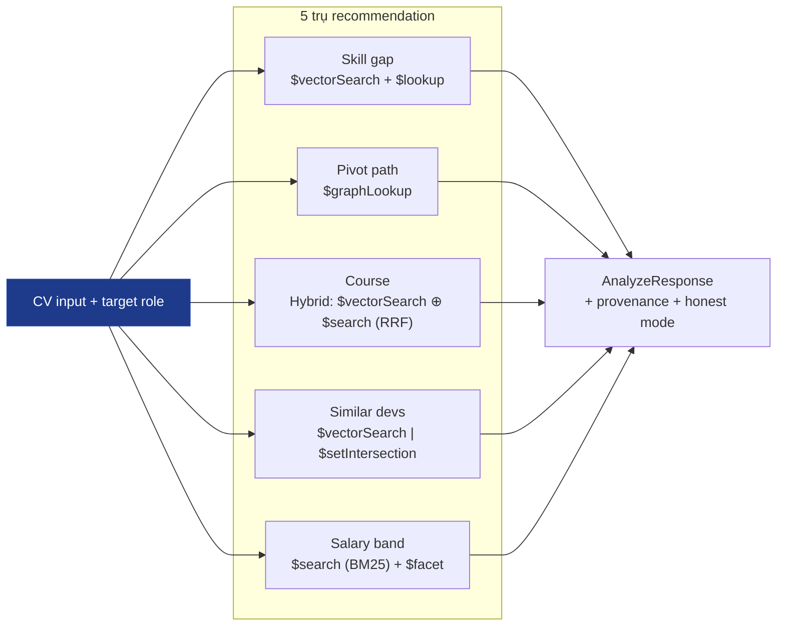

### 1.3 Phạm vi MVP

| Hạng mục | Trạng thái |
|---|---|
| Paste / nhập CV và chọn target role | Đã có |
| LLM trích skill từ CV (gpt-4o-mini, JSON mode) | Đã có |
| Tạo embedding 768 chiều (text-embedding-3-small) | Đã có |
| Skill gap analysis (Vector Search + transition evidence) | Đã có |
| Pivot path recommendation (3 flavor) | Đã có |
| Trajectory graph UI (`@xyflow/react`) | Đã có |
| Proof drawer (sample size, conversion, salary stats, examples) | Đã có |
| Similar developers (vector + skill-overlap fallback) | Đã có |
| Course recommendation (Hybrid Search: Vector ⊕ Atlas Search via RRF) | Đã có |
| VN salary band (`jobs` collection, ITViec sample, Atlas Search BM25) | Đã có |
| Salary inference sau pivot | Đã có |
| Skill explain drawer (transparency: hiển thị aggregation pipeline) | Đã có |
| Honest mode + i18n VI/EN + theme switcher | Đã có |
| User session persistence | Schema đã có, runtime chưa ghi |

### 1.4 Triết lý thiết kế

- Recommendation **không** chỉ là output từ LLM. LLM chỉ phụ trách trích xuất skill từ CV; mọi recommendation chính được tính từ MongoDB.
- Mọi recommendation đều có **provenance** rõ ràng trong UI: nguồn dữ liệu (`synthetic_vn`, `itviec_sample`, `roadmap.sh`, `learn.mongodb.com`), aggregation stage được sử dụng, sample size.
- **Honest Mode** quyết định cách render khi dữ liệu nhỏ:
  - `N ≥ 30`: hiển thị bình thường.
  - `10 ≤ N < 30`: hiển thị cảnh báo low confidence.
  - `N < 10`: ẩn card, thay bằng placeholder `insufficient data`.
- Orchestrator runtime **stateless**: không lưu CV của người dùng vào DB trong luồng `/api/analyze`.

---

## 2. Kiến trúc hệ thống tổng thể

### 2.1 Stack

| Layer | Công nghệ |
|---|---|
| Frontend | Next.js `16.1.1`, React `19.2.3`, TypeScript, Tailwind CSS 4, shadcn/ui |
| Graph UI | `@xyflow/react` `12.10.2` |
| Backend | Hono `4.12.x`, Node.js `>=20.12`, TypeScript |
| Validation + OpenAPI | Zod 4 + `@hono/zod-openapi` + `@hono/swagger-ui` |
| Database | MongoDB Atlas (Vector Search + Aggregation Pipeline) |
| AI | OpenAI `gpt-4o-mini` (LLM) + `text-embedding-3-small` (embedding) |
| Embedding shape | 768 chiều (Matryoshka truncation qua tham số `dimensions=768`) |
| ETL | Python 3.11 + `pymongo` |
| Logging | `pino` (structured JSON log) |

### 2.2 Kiến trúc service

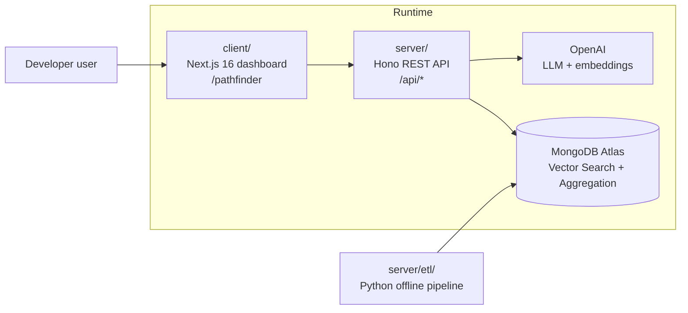

### 2.3 Backend runtime

Entry point: `server/src/index.ts`.

Global middleware đang dùng:

- `requestId` — gắn ID cho mỗi request, propagate vào log
- `timing` — `Server-Timing` header
- `secureHeaders` — security headers chuẩn OWASP
- `compress` — chỉ bật trong production
- `cors` — `CORS_ORIGINS` cấu hình qua env
- structured request logging với `pino`

Graceful shutdown đóng MongoDB connection ở `SIGTERM` / `SIGINT`.

### 2.4 Tách trách nhiệm

| Thành phần | Trách nhiệm |
|---|---|
| `client/` | Form nhập liệu, render dashboard + graph, badge, i18n VI/EN, state phía browser |
| `server/src/routes/` | API public và OpenAPI contract |
| `server/src/services/openai.ts` | Skill extraction (JSON mode) và embedding |
| `server/src/services/vector-search/` | Gap analysis, similar devs, course recommendation |
| `server/src/services/aggregations/` | Pivot path, proof drawer, salary band, salary inference, skill explain |
| `server/src/lib/role-normalizer.ts` | Map title tự do của LLM về 10 role canonical |
| `server/src/schemas/` | Zod schema dùng chung cho request/response và OpenAPI |
| `server/etl/` | Sinh dữ liệu, embedding offline, tạo index, precompute graph transitions |

### 2.5 Hai tầng dữ liệu

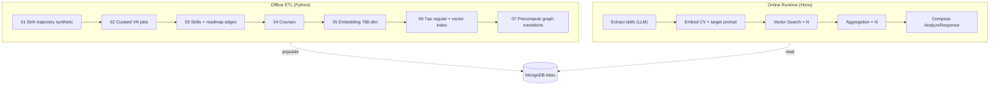

---

## 3. Luồng runtime end-to-end

### 3.1 Sequence của `POST /api/analyze`

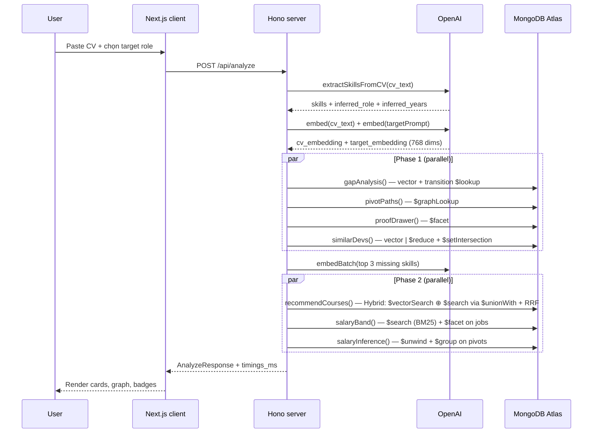

### 3.2 Các bước chi tiết trong orchestrator

File: `server/src/routes/orchestrator.ts`.

1. Validate `cv_text` (`50..8000` ký tự) và `target_role` (≥ 1 ký tự).
2. Gọi `gpt-4o-mini` (JSON mode, `temperature=0.2`) để trích `skills`, `inferred_role`, `inferred_years`.
3. Tạo embedding 768 chiều cho:
   - CV gốc.
   - **Target prompt giàu ngữ cảnh role** — bảng `TARGET_HINTS` chứa stack thực tế của 13 role phổ biến (AI Engineer, ML Engineer, Data Engineer, DevOps Engineer, Cloud Engineer, Solutions Architect, Engineering Manager, Mobile RN, Full-stack, Embedded, QA Automation, Security, …). Nếu không khớp, fallback prompt chung. Mục đích: vector của target không chỉ bám vào title mà bám vào stack thật.
4. Chọn start skill theo thứ tự ưu tiên: level cao → tenure dài → skill đầu tiên.
5. Chuẩn hóa role bằng `role-normalizer.ts`:
   - exact match
   - regex theo title
   - weighted vote theo skill stack
   - fallback `Backend Developer`
6. Phase 1 chạy song song bằng `Promise.all`:
   - `gapAnalysis()`
   - `pivotPaths()`
   - `proofDrawer()`
   - `similarDevs()`
7. Lấy top 3 missing skill, batch embed bằng `embedBatch` (1 round-trip OpenAI).
8. Phase 2 chạy song song:
   - `recommendCourses()` (3 lần, mỗi missing skill)
   - `salaryBand()`
   - `salaryInference()`
9. Trả `AnalyzeResponse` với `timings_ms` đo bằng `performance.now()` cho từng giai đoạn.

### 3.3 Tại sao cần role normalizer

Dataset `career_trajectories` chỉ chứa 10 role canonical:

```
Frontend Developer · Backend Developer · Full-stack Developer
Mobile Developer · Data Engineer · Data Scientist
ML Engineer · AI Engineer · DevOps Engineer · Cloud Engineer
```

LLM hay sinh title như `Tech Lead`, `Senior Software Engineer`, `Software Architect`. Nếu match thẳng vào aggregation, kết quả thường là 0 dòng. `role-normalizer.ts` đảm bảo proof drawer và similar devs luôn có cohort match.

---

## 4. Thiết kế dữ liệu MongoDB

### 4.1 Collections runtime

| Collection | Vai trò | Sử dụng runtime |
|---|---|---|
| `skills` | Taxonomy skill + embedding | Có |
| `courses` | Course catalog + embedding | Có |
| `jobs` | JD/salary sample Việt Nam | Có |
| `career_trajectories` | Cohort trajectory + pivot events | Có |
| `skill_transitions` | Graph edge precompute từ trajectory | Có |
| `roadmap_edges` | Cạnh roadmap.sh hỗ trợ taxonomy | ETL phụ trợ (không query trực tiếp ở runtime) |
| `users` | Schema profile được LLM trả về (`UserSkill`) | In-memory only — chưa có collection thật trên Atlas |

### 4.2 ER diagram

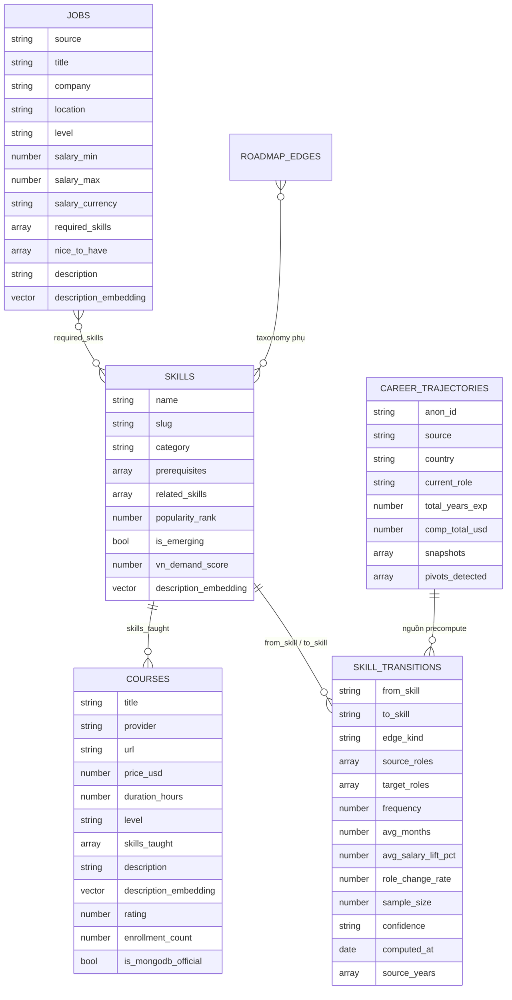

### 4.3 Schema chi tiết

#### `skills`

Mỗi skill là một node trong taxonomy, có thể được đính prerequisites và related_skills để chạy logic gợi ý kèm theo.

| Field | Kiểu | Mục đích |
|---|---|---|
| `name` | string (unique) | Canonical name |
| `slug` | string | URL-safe identifier |
| `category` | enum | `language` / `framework` / `database` / `cloud` / `tool` / `concept` / `soft` |
| `description` | string | Mô tả ngắn |
| `description_embedding` | vector(768) | Phục vụ Vector Search |
| `prerequisites` | string[] | Skill cần học trước |
| `related_skills` | string[] | Skill bổ trợ |
| `popularity_rank` | number | Xếp hạng phổ biến |
| `is_emerging` | boolean | Đánh dấu skill mới nổi |
| `vn_demand_score` | number | Demand thị trường VN |

#### `courses`

| Field | Kiểu | Mục đích |
|---|---|---|
| `title` / `provider` / `url` | string | Metadata khóa học |
| `price_usd` | number | Filter trong vector search |
| `duration_hours` / `level` | number / enum | UI sort |
| `skills_taught` | string[] | Match exact với skill name |
| `description_embedding` | vector(768) | Vector Search |
| `is_mongodb_official` | boolean | Boost cho khóa học của MongoDB University |

#### `jobs` (ITViec sample, ngân sách `M0` ~20 docs)

| Field | Kiểu | Mục đích |
|---|---|---|
| `source` | string | Nguồn dữ liệu (`itviec_sample`) |
| `title` / `company` / `location` | string | Filter cơ bản |
| `level` | enum | Bucket theo seniority |
| `salary_min` / `salary_max` | number (VND triệu) | Tính band |
| `required_skills` / `nice_to_have` | string[] | Match overlap với top missing skills |
| `description_embedding` | vector(768) | Vector index dự phòng |

#### `career_trajectories`

Document hình "linked-list" của một developer ẩn danh:

```jsonc
{
  "anon_id": "vn-0001",
  "source": "synthetic_vn",
  "country": "Vietnam",
  "current_role": "AI Engineer",
  "total_years_exp": 5.5,
  "comp_total_usd": 32000,
  "snapshots": [
    {
      "role": "Backend Developer",
      "skills_have": ["Java", "Spring", "MongoDB"],
      "skills_want": ["LangChain", "RAG"],
      "year": 2023,
      "comp_usd": 22000,
      "cv_embedding": [/* 768 floats */]   // ETL có thể populate ở step 5
    },
    { "role": "AI Engineer", "skills_have": ["Java", "Spring", "MongoDB", "LangChain", "RAG"], "year": 2025, "comp_usd": 32000 }
  ],
  "pivots_detected": [
    {
      "from_role": "Backend Developer",
      "to_role": "AI Engineer",
      "skill_added": ["LangChain", "RAG", "Vector Database"],
      "months_taken": 11,
      "salary_lift_pct": 0.45
    }
  ]
}
```

#### `skill_transitions`

Edge document **đã precompute** từ `career_trajectories.pivots_detected`. Một pivot được "expand" thành chuỗi cạnh:

```
from_role → skill_1 → skill_2 → … → skill_n → to_role
```

| Field | Kiểu | Mục đích |
|---|---|---|
| `from_skill` / `to_skill` | string | Hai đầu của edge |
| `edge_kind` | enum | `role_to_skill` / `skill_to_skill` / `skill_to_role` |
| `source_roles` / `target_roles` | string[] | Mọi role mà chuỗi bắt nguồn / hướng tới (dùng để filter trong `$graphLookup`) |
| `frequency` / `sample_size` | number | Số lần edge xuất hiện trong cohort |
| `avg_months` / `median_months` | number | Thời lượng trung bình |
| `avg_salary_lift_pct` | number | Mức lift sau pivot (chỉ áp lên cạnh `skill_to_role`) |
| `role_change_rate` | number | 1 nếu là cạnh dẫn về role, 0 nếu ngang |
| `confidence` | enum | `high` (≥100), `medium` (≥30), `low` |
| `computed_at` | date | Thời điểm tính |
| `source_years` | array | Năm nguồn dữ liệu |

Index unique trên `(from_skill, to_skill)` đảm bảo `$out` của step 7 idempotent.

#### `roadmap_edges`

Lưu các cạnh ReactFlow của roadmap.sh — dùng làm taxonomy phụ khi step 03 cần biết một concept thuộc nhóm con nào của một roadmap (ví dụ "Vector Search" thuộc roadmap "AI Engineer"). Runtime không query trực tiếp; vai trò chính là input cho ETL bước 03 và 07.

| Field | Kiểu | Mục đích |
|---|---|---|
| `roadmap_slug` | string | Slug của roadmap nguồn (`ai-engineer`, `backend`, …) |
| `roadmap_title` | string (optional) | Tên hiển thị của roadmap |
| `source_node_id` / `target_node_id` | string | ID node trong file ReactFlow của roadmap.sh |
| `from_label` / `to_label` | string | Label canonical của hai node — đây là cái match với `skills.name` |
| `computed_at` | date (optional) | Thời điểm scrape |

Compound index `(roadmap_slug, source_node_id)` để lookup nhanh khi traverse roadmap; index thứ hai chỉ trên `roadmap_slug` cho aggregation theo nhóm.

Schema chính thức ở `server/src/schemas/roadmap.ts` (`RoadmapEdgeDocSchema`).

#### `users` (chỉ là shape của profile — không phải collection persisted)

Trái với cảm tưởng từ tên file, `users` **không** phải là collection runtime. Schema này chỉ định nghĩa shape của một skill mà LLM trả về sau khi parse CV (`UserSkill`):

| Field | Kiểu | Mục đích |
|---|---|---|
| `name` | string (≥1 ký tự) | Tên skill |
| `level` | enum `beginner` / `intermediate` / `advanced` | Mức thành thạo |
| `years` | number `[0, 50]` | Số năm kinh nghiệm với skill |

Orchestrator runtime stateless: object `ExtractedProfile` được build trong memory và gắn thẳng vào `AnalyzeResponse`, không insert vào Atlas. Khi nào bật session persistence sẽ cần thêm `users` collection thật + TTL index — tham khảo §10.5 để biết giới hạn hiện tại.

### 4.4 Vì sao chọn MongoDB

| Nhu cầu | Lợi ích MongoDB |
|---|---|
| Snapshot trajectory có độ dài khác nhau | Embedded array tự nhiên hơn schema bảng |
| Vector và metadata cùng document | Không cần thêm Vector DB riêng |
| Recommendation cần join + analytics | `$lookup`, `$facet`, `$group`, `$graphLookup` đủ dùng |
| Taxonomy thay đổi liên tục | Schema linh hoạt, không cần migration nặng |
| Filter trước khi vector search | Atlas Vector Search hỗ trợ pre-filter trong cùng stage |
| Precompute graph khi rảnh, query nhanh khi runtime | `$out` ghi đè kết quả aggregation thành collection mới |

---

## 5. Áp dụng MongoDB Vector Search

### 5.1 Tổng quan các vector index

| Index | Collection | Vector path | Filter paths | Status |
|---|---|---|---|---|
| `vec_skills_desc` | `skills` | `description_embedding` | `category`, `is_emerging` | Đang query runtime |
| `vec_courses_desc` | `courses` | `description_embedding` | `price_usd`, `is_mongodb_official` | Đang query runtime |
| `vec_trajectory_snapshot` | `career_trajectories` | `snapshots.cv_embedding` | `country` | Có path runtime, fallback aggregation khi index rỗng |
| `vec_jobs_desc` | `jobs` | `description_embedding` | `level`, `location` | Định nghĩa, dự phòng feature tương lai |

Mọi index đều `numDimensions: 768` và `similarity: cosine`. Định nghĩa nằm trong `server/etl/06_create_indexes.py`.

### 5.2 Skill gap analysis (Vector Search + transition evidence)

File: `server/src/services/vector-search/skills.ts`.

Chạy **hai đường retrieval song song** rồi merge:

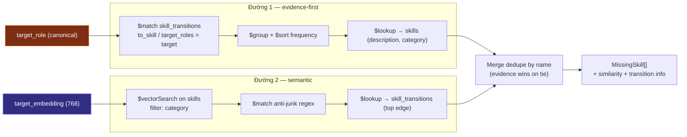

#### 5.2.1 Đường evidence-first (`skill_transitions`)

Pre-computed graph là nguồn cao tin cậy nhất: skill nào đã giúp người thật pivot vào target role.

```js
// Rút gọn cho dễ đọc
[
  { $match: { $or: [
      { to_skill: targetRole },
      { target_roles: targetRole },
      { target_roles: { $in: [targetRole] } }
  ]}},
  { $addFields: { candidate_skill: { $cond: [
      { $eq: ['$edge_kind', 'skill_to_role'] }, '$from_skill', '$to_skill'
  ]}}},
  { $match: { candidate_skill: { $ne: targetRole } } },
  { $group: {
      _id: '$candidate_skill',
      avg_months: { $avg: '$avg_months' },
      avg_salary_lift_pct: { $max: '$avg_salary_lift_pct' },
      frequency: { $sum: '$frequency' }
  }},
  { $sort: { frequency: -1, avg_salary_lift_pct: -1 } },
  { $limit: limit * 2 },
  { $lookup: {
      from: 'skills',
      let: { skName: '$_id' },
      pipeline: [
        { $match: { $expr: { $eq: ['$name', '$$skName'] } } },
        { $project: { _id: 0, description: 1, category: 1, vn_demand_score: 1 } }
      ],
      as: 'skill_info'
  }}
]
```

#### 5.2.2 Đường semantic fallback (`$vectorSearch`)

```js
[
  { $vectorSearch: {
      index: env.VECTOR_INDEX_SKILLS,
      path: 'description_embedding',
      queryVector: target_embedding,
      numCandidates: Math.max(400, limit * 30),
      limit: Math.max(limit * 6, 60),
      filter: { category: { $in: ['framework','tool','concept','cloud','language'] } }
  }},
  { $match: { /* hàng loạt regex filter chống junk title từ roadmap.sh */ } },
  { $project: { _id: 0, name: 1, category: 1, description: 1, vn_demand_score: 1,
      similarity: { $meta: 'vectorSearchScore' } } },
  { $lookup: {
      from: 'skill_transitions',
      let: { skillName: '$name' },
      pipeline: [
        { $match: { $expr: { $eq: ['$from_skill', '$$skillName'] } } },
        { $sort: { frequency: -1 } },
        { $limit: 1 }
      ],
      as: 'transition_info'
  }},
  { $addFields: { transition: { $arrayElemAt: ['$transition_info', 0] } } }
]
```

#### 5.2.3 Merge logic

Service-side dedupe theo `normalizeSkillKey` (lowercase, strip non-alphanum), evidence row luôn thắng semantic row. Sau đó loại bỏ skill user đã có. Kết quả trả về có `similarity` đã chuẩn hóa, `transition` đính kèm để UI hiển thị tháng học và salary lift dự kiến.

### 5.3 Course recommendation — Hybrid Search (Vector + Atlas Search + RRF)

File: `server/src/services/vector-search/courses.ts`.

Bản triển khai theo đúng pattern *"Perform Hybrid Search with MongoDB Vector Search and MongoDB Search"* trong tài liệu chính thức: hai retrieval lane (vector + lexical) chạy song song, mỗi lane sinh thứ hạng riêng, kết quả được hợp nhất bằng **Reciprocal Rank Fusion (RRF)**:

$$\text{score}(d) = \sum_{lane}\frac{w_{lane}}{k + \text{rank}_{lane}(d)} \quad (k = 60)$$

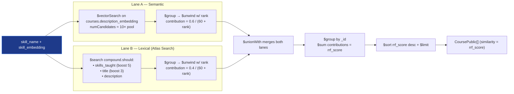

```js
// Rút gọn — bỏ qua $project cuối
[
  // Lane A: vector
  { $vectorSearch: {
      index: env.VECTOR_INDEX_COURSES,
      path: 'description_embedding',
      queryVector: skill_embedding,
      numCandidates: Math.max(candidatePool * 10, 200),
      limit: candidatePool,
      filter: { $or: [
        { is_mongodb_official: true }, { price_usd: 0 }, { price_usd: { $lte: 50 } }
      ]}
  }},
  { $group: { _id: null, docs: { $push: { doc: '$$ROOT', score: { $meta: 'vectorSearchScore' } } } } },
  { $unwind: { path: '$docs', includeArrayIndex: 'rank' } },
  { $project: {
      _id: '$docs.doc._id', doc: '$docs.doc',
      rrf_contribution: { $divide: [0.6, { $add: [60, '$rank'] }] }
  }},

  // Lane B: lexical $search, merged via $unionWith
  { $unionWith: {
      coll: 'courses',
      pipeline: [
        { $search: {
            index: env.SEARCH_INDEX_COURSES,
            compound: {
              should: [
                { text: { query: skill_name, path: 'skills_taught', score: { boost: { value: 5 } } } },
                { text: { query: skill_name, path: 'title',         score: { boost: { value: 3 } } } },
                { text: { query: skill_name, path: 'description' } }
              ],
              minimumShouldMatch: 1
            }
        }},
        // Cùng pre-filter giá/official như lane vector
        { $match: { $or: [
          { is_mongodb_official: true }, { price_usd: 0 }, { price_usd: { $lte: 50 } }
        ]}},
        { $limit: candidatePool },
        { $group: { _id: null, docs: { $push: '$$ROOT' } } },
        { $unwind: { path: '$docs', includeArrayIndex: 'rank' } },
        { $project: {
            _id: '$docs._id', doc: '$docs',
            rrf_contribution: { $divide: [0.4, { $add: [60, '$rank'] }] }
        }}
      ]
  }},

  // Fuse
  { $group: { _id: '$_id', doc: { $first: '$doc' }, rrf_score: { $sum: '$rrf_contribution' } } },
  { $sort: { rrf_score: -1 } },
  { $limit: limit },
  { $replaceWith: { $mergeObjects: ['$doc', { rrf_score: '$rrf_score' }] } }
]
```

Trọng số `(0.6 / 0.4)` ưu tiên semantic nhưng vẫn để lexical "cứu" những trường hợp embedding lệch khỏi tên canonical. Field `similarity` trả về client thực chất là `rrf_score` (đã chuẩn hóa) để giữ nguyên contract cũ.

**Fallback (vector-only)** — nếu Atlas Search index `courses_text_search` chưa tồn tại (cluster local hoặc chưa chạy `06_create_indexes.py`), service tự động bắt lỗi và degrade về `$vectorSearch` đơn lane với một soft boost `exact_match` trên `skills_taught`.

### 5.4 Similar developers

File: `server/src/services/vector-search/similar-devs.ts`.

Hai đường, primary là vector, fallback là aggregation overlap:

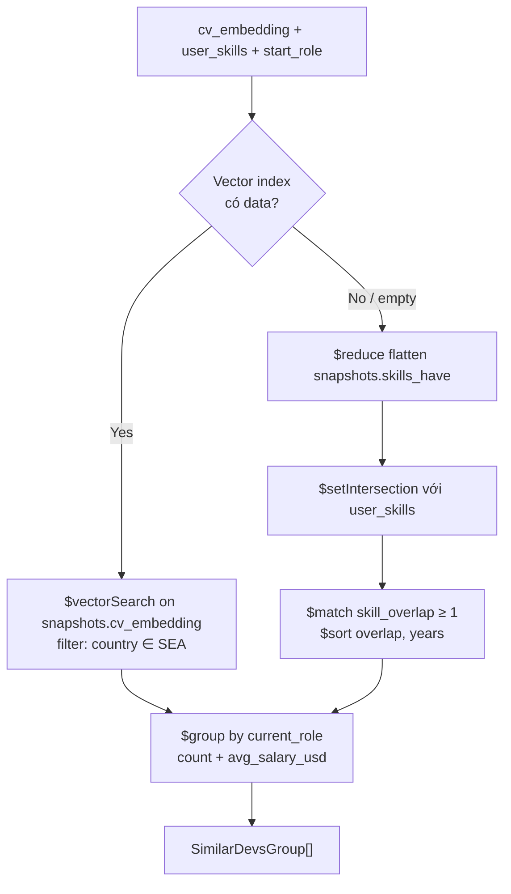

#### 5.4.1 Vector path

```js
{ $vectorSearch: {
    index: env.VECTOR_INDEX_TRAJECTORIES,
    path: 'snapshots.cv_embedding',
    queryVector: cv_embedding,
    // 10–20× limit theo khuyến nghị Atlas Vector Search; floor 200 cho
    // limit nhỏ.
    numCandidates: Math.max(limit * 15, 200),
    limit,
    filter: { country: { $in: ['Vietnam','Singapore','SEA','Thailand','Indonesia','Malaysia','Philippines'] } }
}}
```

Sau đó `$group` theo `current_role`, tính `count` và `avg_salary_usd`.

#### 5.4.2 Fallback overlap

Khi snapshot chưa được embed (dataset hiện đang dùng `$reduce` flatten + `$setIntersection`):

```js
[
  { $match: { country: { $in: SEA }, $or: matchConditions } },
  { $addFields: { all_skills: { $reduce: {
      input: { $ifNull: ['$snapshots.skills_have', []] },
      initialValue: [],
      in: { $setUnion: ['$$value', '$$this'] }
  }}}},
  { $addFields: { skill_overlap: { $size: { $setIntersection: ['$all_skills', skillSet] } } } },
  { $match: { skill_overlap: { $gte: 1 } } },
  { $sort: { skill_overlap: -1, total_years_exp: -1 } },
  { $limit: limit },
  { $group: { _id: '$current_role', count: { $sum: 1 }, avg_salary_usd: { $avg: '$comp_total_usd' } } },
  { $sort: { count: -1 } },
  { $limit: 8 }
]
```

### 5.5 Vì sao Atlas Vector Search

- Cho phép **filter pre-search**, giảm số candidate phải tính cosine.
- `numCandidates` lớn (~10–20× limit theo khuyến nghị docs) đảm bảo recall ≥95% theo benchmark Atlas.
- `$meta: 'vectorSearchScore'` cho score 0..1, dễ kết hợp với heuristic khác.
- Index nằm cùng collection với metadata, không cần đồng bộ chéo Vector DB.

### 5.6 Atlas Search (Full-Text Search) — `$search`

Bên cạnh Vector Search, project cũng dùng **Atlas Search** (Lucene-backed full-text search) để bổ sung khả năng tokenization, BM25 ranking và fuzzy match — những thứ vector search một mình không tối ưu.

| Index | Collection | Mappings | Phục vụ |
|---|---|---|---|
| `jobs_text_search` | `jobs` | `title` (lucene.standard), `required_skills`/`company`/`level`/`location` (lucene.keyword), `description` (lucene.standard) | Salary band — `compound.should` tìm JD theo role + skill |
| `courses_text_search` | `courses` | `title`/`description` (lucene.standard), `skills_taught`/`provider`/`level` (lucene.keyword) | Hybrid course search — lane lexical trong RRF fusion |

Định nghĩa nằm trong `server/etl/06_create_indexes.py`, dùng PyMongo `SearchIndexModel(definition=..., name=..., type='search')`.

Lý do giữ song song với Vector Search:

- **Tokenization** — `lucene.standard` chia "AI/ML Engineer" thành các token có nghĩa, regex thô không làm được.
- **Exact taxonomy hit** — `lucene.keyword` cho phép khớp đúng tên skill canonical như "Vector Search" (không bị trộn với "Search" generic).
- **Scoring chuẩn** — BM25 cho score relative ranked, dùng được trong RRF fusion với vector score.
- **Tài liệu chính thức** — `$search` và `$vectorSearch` được MongoDB cung cấp như hai mặt bổ trợ; hybrid search là pattern khuyến nghị cho RAG-style recommendation.

---

## 6. Áp dụng MongoDB Aggregation Pipeline

### 6.1 Pivot path bằng `$graphLookup`

File: `server/src/services/aggregations/pivot-path.ts`.

`$graphLookup` là stage cốt lõi để khai phá lộ trình đa hop. Sau khi orchestrator xác định `start_role` và `target_role`, service truy vấn **đa hop** trên `skill_transitions`:

```js
[
  { $match: {
      from_skill: start_node,
      target_roles: target_node,
      $or: [{ edge_kind: 'role_to_skill' }, { edge_kind: { $exists: false } }]
  }},
  { $graphLookup: {
      from: 'skill_transitions',
      startWith: '$to_skill',
      connectFromField: 'to_skill',
      connectToField: 'from_skill',
      as: 'downstream',
      maxDepth: max_depth - 1,
      depthField: 'depth',
      restrictSearchWithMatch: {
        confidence: { $in: ['high','medium','low'] },
        target_roles: target_node
      }
  }}
]
```

Sau khi có toàn bộ subgraph reachable, service:

1. Build adjacency map `from_skill → edges`.
2. DFS từ `start_node` đến `target_node`, depth ≤ `max_depth`.
3. Cho ra danh sách `CandidatePath` với metric `total_months`, `total_lift_pct`, `min_confidence`, `support`.
4. Chọn 3 flavor:
   - `fast` — sort theo `total_months` (ngắn nhất).
   - `balanced` — score `(lift / months) × log10(support+1)`.
   - `comprehensive` — ưu tiên path dài hơn, confidence cao hơn.
5. Đảm bảo 3 path không trùng signature.

Sơ đồ luồng:

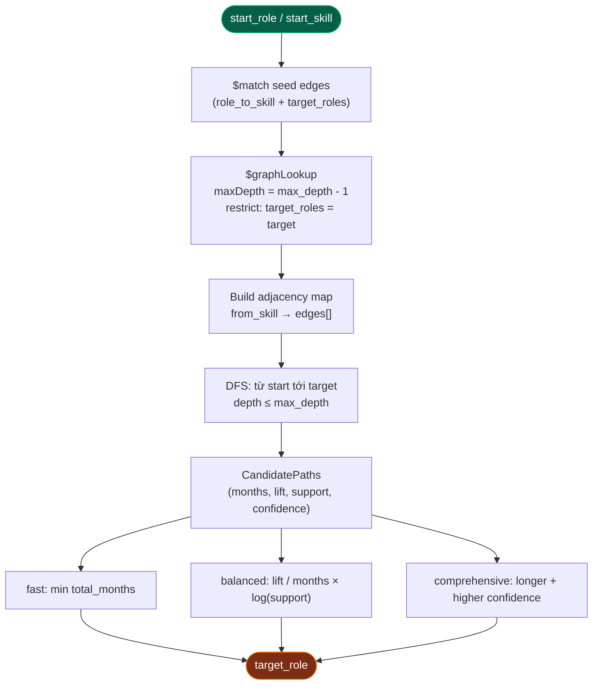

Khi DB cũ chỉ còn legacy `skill → role` (chưa rerun ETL step 7), service tự động fallback về synthesis cũ để API không bị tối.

### 6.2 Proof drawer bằng `$facet`

File: `server/src/services/aggregations/proof-drawer.ts`.

Một round-trip duy nhất chạy 5 facet độc lập:

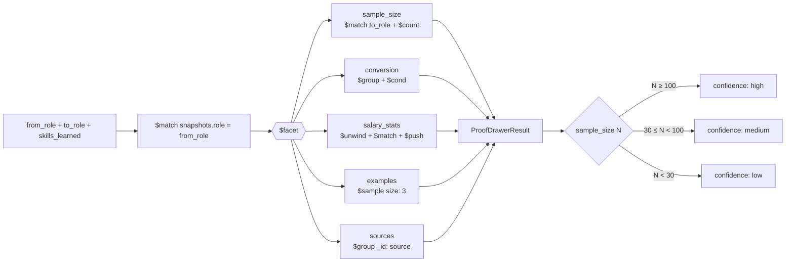

```js
[
  { $match: { 'snapshots.role': from_role } },
  { $facet: {
      sample_size: [
        { $match: { 'pivots_detected.to_role': to_role } },
        { $count: 'n' }
      ],
      conversion: [
        { $group: {
            _id: null,
            total_with_intent: { $sum: 1 },
            total_completed: { $sum: { $cond: [{ $eq: ['$current_role', to_role] }, 1, 0] } }
        }}
      ],
      salary_stats: [
        { $unwind: '$pivots_detected' },
        { $match: { 'pivots_detected.to_role': to_role, ...skillsMatch } },
        { $group: {
            _id: null,
            lifts: { $push: '$pivots_detected.salary_lift_pct' },
            months: { $push: '$pivots_detected.months_taken' }
        }}
      ],
      examples: [
        { $match: { 'pivots_detected.to_role': to_role } },
        { $sample: { size: 3 } },
        { $project: {
            _id: 0, anon_id: 1, current_role: 1, total_years_exp: 1,
            starting_role: { $arrayElemAt: ['$snapshots.role', 0] },
            ed_level: 1, source: 1
        }}
      ],
      sources: [
        { $group: { _id: '$source' } },
        { $project: { _id: 0, source: '$_id' } }
      ]
  }}
]
```

Sau đó:

- `confidence` được ánh xạ: `n ≥ 100 → high`, `n ≥ 30 → medium`, còn lại `low`.
- `median_lift_pct` tính chính xác (sort + lấy giữa) trong service code; `min`/`max` cũng từ mảng `lifts`.
- `data_sources` cho UI gắn badge nguồn (`synthetic_vn`, `itviec_sample`, …).

### 6.3 Salary band — Atlas Search (`$search`) + `$facet`

File: `server/src/services/aggregations/salary-band.ts`.

Trước đây stage đầu là `$match` với `$regex` thô trên `title`. Bản hiện tại dùng **Atlas Search `$search`** với `compound.should` để có Lucene tokenization và BM25 ranking. Nhánh fallback `$regex` được giữ lại cho cluster chưa có Atlas Search index.

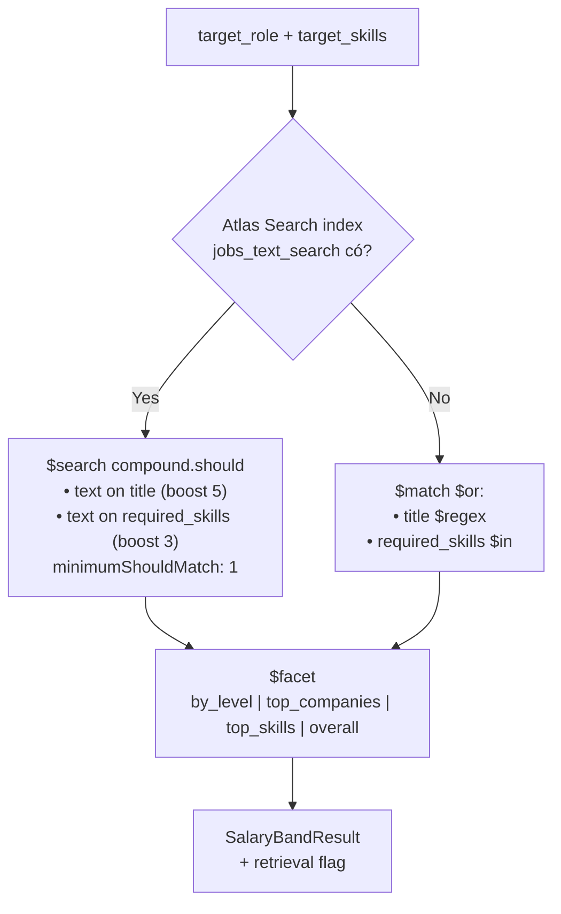

```js
// Primary path
[
  { $search: {
      index: env.SEARCH_INDEX_JOBS,
      compound: {
        should: [
          { text: { query: keywords, path: 'title',
                    score: { boost: { value: 5 } } } },
          { text: { query: target_skills, path: 'required_skills',
                    score: { boost: { value: 3 } } } }
        ],
        minimumShouldMatch: 1
      }
  }},
  { $addFields: { search_score: { $meta: 'searchScore' } } },
  { $facet: {
      by_level: [ /* $group level + avg/min/max + $sort */ ],
      top_companies: [ /* $sort + $group company + $limit 5 */ ],
      top_skills: [ /* $unwind required_skills + $group + $limit 8 */ ],
      overall: [ /* $group null + n/avg/min/max */ ]
  }}
]
```

`keywords` là tập alias title cho role (`'AI Engineer AI/ML LLM Generative AI GenAI'`), `target_skills` là top missing skill từ gap analysis. `compound.should` + `minimumShouldMatch: 1` thay cho `$or` cũ — JD chỉ cần khớp một trong hai signal là vào pool, nhưng score cao hơn khi khớp cả hai.

Response có thêm field `retrieval: 'atlas_search' | 'regex_fallback'` để client gắn badge "matched via Atlas Search BM25" khi có.

### 6.4 Salary inference bằng `$unwind` + `$group`

File: `server/src/services/aggregations/salary-inference.ts`.

```js
[
  { $match: { country: { $in: countries } } },
  { $unwind: '$pivots_detected' },
  { $match: { 'pivots_detected.skill_added': { $in: skills_learned } } },
  { $addFields: { overlap_count: { $size: {
      $setIntersection: ['$pivots_detected.skill_added', skills_learned]
  }}}},
  { $group: {
      _id: '$pivots_detected.to_role',
      sample_size: { $sum: 1 },
      months: { $push: '$pivots_detected.months_taken' },
      lifts: { $push: '$pivots_detected.salary_lift_pct' },
      avg_overlap: { $avg: '$overlap_count' }
  }},
  { $match: { sample_size: { $gte: 3 } } },
  { $sort: { avg_overlap: -1, sample_size: -1 } },
  { $limit: 10 }
]
```

`median_lift_pct` được tính chính xác trong service (sort + middle), không phải `$avg`, đảm bảo robust với outlier.

### 6.5 Skill explain — radical transparency

File: `server/src/services/aggregations/skill-explain.ts`.

Mỗi skill trong gap output có drawer "Why this skill?" trả về **bốn pipeline thực** chạy cho card này, để judge có thể paste sang Atlas của họ và reproduce:

| Pipeline | Collection | Mục đích |
|---|---|---|
| `skill_transitions_pipeline` | `skill_transitions` | Edge gốc kết nối skill → target role |
| `skill_metadata_pipeline` | `skills` | Description, prerequisites, vn_demand_score |
| `role_distribution_pipeline` | `career_trajectories` | Skill này dẫn tới role nào và nhiều tới đâu |
| `sample_trajectories_pipeline` | `career_trajectories` | Top 3 pivot example (anonymized) |

Endpoint trả thêm `aggregation_stages: ['match','unwind','group','sort','limit','project']` cho UI render badge.

### 6.6 Precompute graph bằng `$out`

File: `server/etl/07_compute_transitions.py`.

ETL biến mỗi pivot thành chuỗi cạnh thật rồi dùng `$concatArrays` + `$map` + `$range` để sinh edges, rồi `$out: 'skill_transitions'` ghi đè collection.

Sơ đồ expand một pivot thành chuỗi cạnh:

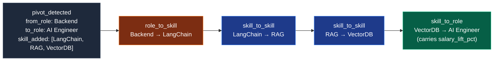

```python
{"$concatArrays": [
    [ /* role_to_skill: from_role -> first_added_skill */ ],
    { "$map": { "input": { "$range": [0, n-1] },
                "as": "idx",
                "in": { /* skill_to_skill: skill[i] -> skill[i+1] */ } } },
    [ /* skill_to_role: last_added_skill -> to_role */ ]
]}
```

Sau khi expand, `$group` theo `(from_skill, to_skill, edge_kind)`:

```python
"$switch": {
    "branches": [
        {"case": {"$gte": ["$frequency", 100]}, "then": "high"},
        {"case": {"$gte": ["$frequency", 30]},  "then": "medium"}
    ],
    "default": "low"
}
```

Đây là điểm nhấn chính: thay vì BFS runtime đắt đỏ, ETL build sẵn graph để runtime chỉ chạy `$graphLookup` đơn giản.

### 6.7 Tổng hợp aggregation stages đã sử dụng

| Stage | Use case |
|---|---|
| `$match` | Mọi pipeline |
| `$project` | Mọi pipeline |
| `$search` (Atlas Search) | Salary band (BM25 trên title + required_skills), Course recommendation (lane lexical) |
| `$vectorSearch` (Atlas Vector Search) | Gap analysis, Course recommendation (lane semantic), Similar devs |
| `$unionWith` | Hybrid course search — gộp lane vector và lane lexical |
| `$lookup` (with `let` + pipeline) | Gap analysis (skills × skill_transitions) |
| `$facet` | Proof drawer (5 facet), salary band (4 facet) |
| `$graphLookup` | Pivot path multi-hop |
| `$unwind` (incl. `includeArrayIndex`) | Salary inference, salary band top_skills, skill explain, RRF rank generation |
| `$group` | Mọi aggregation cuối cùng + RRF fusion |
| `$replaceWith` / `$mergeObjects` | RRF — khôi phục document gốc sau fusion |
| `$addFields` / `$cond` / `$switch` | Confidence bucketing, fraction normalization |
| `$reduce` + `$setIntersection` + `$setUnion` | Similar devs fallback |
| `$sample` | Proof drawer examples |
| `$concatArrays` + `$map` + `$range` | ETL build graph edges |
| `$out` | ETL ghi `skill_transitions` |
| `$arrayElemAt` | Lấy snapshot đầu tiên làm `starting_role` |

---

## 7. API contract

### 7.1 Endpoint list

| Method | Path | Chức năng |
|---|---|---|
| `GET` | `/health` | Kiểm tra MongoDB + OpenAI |
| `GET` | `/docs` | Swagger UI |
| `GET` | `/openapi.json` | OpenAPI 3.1 spec |
| `POST` | `/api/extract-skills` | Parse CV bằng LLM |
| `POST` | `/api/embed` | Tạo embedding 768 chiều |
| `POST` | `/api/gap-analysis` | Phân tích skill gap |
| `POST` | `/api/pivot-paths` | Sinh path |
| `POST` | `/api/proof-drawer` | Trả evidence |
| `POST` | `/api/similar-devs` | Nhóm developer tương tự |
| `POST` | `/api/course-recommendations` | Gợi ý course |
| `POST` | `/api/skill-explain` | Drawer "Why this skill?" |
| `POST` | `/api/analyze` | Orchestrator end-to-end |

### 7.2 `POST /api/analyze`

Request:

```json
{
  "cv_text": "string, 50..8000 chars",
  "target_role": "AI Engineer"
}
```

Response cấp cao:

```jsonc
{
  "profile": {
    "skills": [{ "name": "Java", "level": "advanced", "years": 4 }],
    "inferred_role": "Backend Engineer",
    "inferred_years": 4
  },
  "gap_analysis":   { "missing_skills": [/* MissingSkill[] */] },
  "pivot_paths":    { "paths": [/* PivotPath[] */] },
  "proof_drawer":   { "sample_size": 124, "conversion_rate": 0.42, "salary_stats": {/*…*/}, "example_profiles": [/*…*/], "confidence": "high", "data_sources": ["synthetic_vn"] },
  "similar_devs":   { "groups": [{ "role": "AI Engineer", "count": 18, "avg_salary_usd": 32000 }] },
  "courses_by_skill":  [{ "skill": "LangChain", "courses": [/*…*/] }],
  "salary_band":    { "target_role": "AI Engineer", "total_matches": 12, "overall": {/*…*/}, "by_level": [/*…*/], "top_companies": [/*…*/], "top_required_skills": [/*…*/], "source": "itviec_sample" },
  "pivot_salary_lift": [{ "to_role": "AI Engineer", "sample_size": 124, "avg_months": 11.2, "median_lift_pct": 28 }],
  "timings_ms": {
    "extract": 1200, "embed": 400,
    "gap": 350, "paths": 280, "proof": 220, "similar": 240,
    "courses": 380, "salary": 380,
    "total": 2820
  }
}
```

Toàn bộ schema được validate bằng Zod tại `server/src/schemas/api.ts` và sinh OpenAPI tự động.

### 7.3 Error envelope

```json
{
  "error": {
    "code": "string",
    "message": "string",
    "details": {}
  }
}
```

Frontend ánh xạ qua `PathFinderApiError` (xem `client/src/lib/pathfinder/api.ts`).

### 7.4 Health check

`GET /health` thực hiện ping MongoDB và embed một string `"healthcheck"` để xác nhận OpenAI client hoạt động. Trả về `status: ok | degraded | down` cho probe của infra.

---

## 8. Frontend implementation

### 8.1 Entry point

- Route dashboard: `client/src/app/(dashboard)/pathfinder/page.tsx`
- Container: `PathFinderAnalyzer`
- API client: `client/src/lib/pathfinder/api.ts` (typed fetch, timeout 90s mặc định)

### 8.2 Form flow

`AnalyzeForm` cho phép paste CV trực tiếp, validate `50..8000` ký tự, kèm dropdown 12 role preset hoặc free text.

### 8.3 Result cards

`AnalysisResults` lần lượt render:

1. Profile card — output trực tiếp của LLM extract.
2. Gap analysis card — danh sách missing skill với badge category, similarity, transition info; kèm drawer skill explain.
3. Pivot paths card — 3 flavor + tab.
4. Trajectory graph card (`@xyflow/react`) — 3 lane fast / balanced / comprehensive; edge label hiển thị tháng học và salary lift; có pan/zoom + minimap khi đủ lớn.
5. Proof drawer card — sample size, conversion %, salary stats, example anon trajectories, badge data sources.
6. Similar devs card — phân bố role hiện tại của cohort tương đương.
7. Salary band card — VND range theo level + top companies + top required skills.
8. Courses card — 3 missing skill, mỗi skill 3 course, badge `MongoDB Official` + giá.
9. Timings card — bóc tách độ trễ từng giai đoạn.

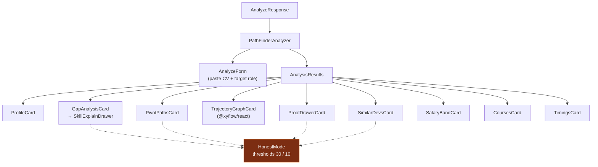

### 8.4 Honest Mode

File: `client/src/app/(dashboard)/pathfinder/components/honest-mode.tsx`.

| Sample size N | UI |
|---|---|
| `N ≥ 30` | Render bình thường |
| `10 ≤ N < 30` | Hiển thị chip "low confidence" |
| `N < 10` | Ẩn card, render placeholder `insufficient data` |

Card cũng gắn badge nguồn dữ liệu (`synthetic_vn`, `itviec_sample`, …) và badge aggregation stage (`$facet`, `$graphLookup`, `$vectorSearch`, …) để judge nhìn được kỹ thuật MongoDB đã dùng.

### 8.5 Skill explain drawer

Khi click vào missing skill, frontend gọi `POST /api/skill-explain` và render:

- Metadata skill (description, prerequisites).
- Transition row (frequency, avg_months, salary lift, confidence).
- Role distribution: skill này dẫn tới role nào và nhiều tới đâu.
- 3 sample trajectory ẩn danh.
- **Pretty-printed JSON của 4 aggregation pipeline thật** đã chạy cho card này — đây là "show your work" angle, mọi recommendation đều có thể audit ngược về MongoDB pipeline.

---

## 9. ETL, embedding và index strategy

### 9.1 Pipeline 7 bước

| Bước | Script | Output | Thời lượng |
|---|---|---|---|
| 1 | `01_generate_trajectories.py` | ~3000 trajectory synthetic SEA, deterministic seed 42 | ~5 s |
| 2 | `02_scrape_itviec.py` | ~20 job rows curated VN | ~2 s |
| 3 | `03_load_skills_roadmap.py` | `skills` + `roadmap_edges` từ roadmap.sh | 30–60 s |
| 4 | `04_load_courses.py` | ~30 courses (MongoDB University + Coursera/Udemy/freeCodeCamp) | ~2 s |
| 5 | `05_embed_all.py` | Embedding 768-dim cho courses, jobs, skills, snapshot trajectory | 2–30 phút |
| 6 | `06_create_indexes.py` | Regular index + 4 vector index + 2 Atlas Search index | 1–3 phút |
| 7 | `07_compute_transitions.py` | Graph `skill_transitions` (`$out`) | ~5 s |

```mermaid
flowchart LR
    S1["01 trajectories<br/>synthetic seed 42"]:::seed
    S2["02 jobs<br/>itviec_sample"]:::seed
    S3["03 skills + roadmap_edges<br/>roadmap.sh"]:::seed
    S4["04 courses<br/>MongoDB U + others"]:::seed

    S1 --> CT[("career_trajectories")]
    S2 --> J[("jobs")]
    S3 --> SK[("skills + roadmap_edges")]
    S4 --> CO[("courses")]

    CT --> S5
    J --> S5
    SK --> S5
    CO --> S5

    S5["05 embed_all<br/>OpenAI 768-dim<br/>(fallback hash)"]:::embed
    S5 --> S6
    S6["06 create_indexes<br/>regular + 4 vector + 2 search"]:::idx
    S6 --> S7
    S7["07 compute_transitions<br/>$concatArrays + $out"]:::graph
    S7 --> ST[("skill_transitions")]

    classDef seed fill:#1e3a8a,stroke:#3b82f6,color:#fff
    classDef embed fill:#312e81,stroke:#6366f1,color:#fff
    classDef idx fill:#065f46,stroke:#10b981,color:#fff
    classDef graph fill:#7c2d12,stroke:#f97316,color:#fff
```

### 9.2 Bước 1 — sinh trajectory synthetic

Stack Overflow Developer Survey không có ID xuyên năm nên không tạo được trajectory thật, đồng thời CDN URL của họ rotate hashed path nên scrape không bền. Giải pháp:

- Sinh ~3000 trajectory **deterministic** (seed `42`).
- Mỗi trajectory có 0–2 pivot rõ ràng, ~62% có ít nhất 1 pivot.
- Role mix, salary band và skill co-occurrence được calibrate theo market signal VN 2025–2026.
- Field `pivots_detected[]` có `from_role`, `to_role`, `skill_added`, `months_taken`, `salary_lift_pct` — đầu vào trực tiếp cho step 7.

Để thay bằng dữ liệu thật, drop CSV vào `data/raw/` rồi viết adapter tuân theo `CareerTrajectoryDoc` Zod schema (xem `server/src/schemas/trajectory.ts`).

### 9.3 Bước 5 — embedding

`text-embedding-3-small` có `dimensions=768` (Matryoshka truncation):

- Giảm storage và index footprint khoảng 50% so với 1536-dim mặc định.
- Cùng schema với index 768 đã build → không cần rebuild khi đổi provider.
- Batch embed cho course / job / skill (1 round-trip mỗi nhóm).

Fallback an toàn: khi quota OpenAI hết hoặc rate-limit (HTTP 429), script tự động dùng **deterministic L2-normalized hash vector** để pipeline ETL không vỡ. Hash vector chỉ giữ shape index, không có semantic — cần rerun bước 5 khi quota ổn định để thay bằng embedding thật.

Switch flag: `EMBED_FORCE_DETERMINISTIC=1` (cho CI/offline), `WIPE_EXISTING_EMBEDDINGS=1` (re-embed toàn bộ khi đổi provider).

### 9.4 Bước 6 — index strategy

#### Regular index (MongoDB native)

| Collection | Index |
|---|---|
| `skills` | `name` unique, `category`, `popularity_rank` |
| `jobs` | `required_skills`, `(level, location)`, `salary_min` |
| `courses` | `skills_taught`, `(provider, level)` |
| `career_trajectories` | `(country, total_years_exp)`, `current_role`, `snapshots.skills_have`, `(pivots_detected.from_role, pivots_detected.to_role)` |
| `skill_transitions` | `(from_skill, to_skill)` unique, `(from_skill, frequency)`, `(to_skill, edge_kind, frequency)` |
| `roadmap_edges` | `(roadmap_slug, source_node_id)`, `roadmap_slug` |

#### Vector Search index

Mỗi index có `{ type: 'vector', numDimensions: 768, similarity: 'cosine' }` cộng với mảng `filter` paths khai báo tường minh (Atlas Vector Search yêu cầu).

Trên Atlas M0/M2/M5, giới hạn 3 search index/cluster (đếm chung cả Atlas Search và Vector Search) khiến script ưu tiên tạo theo thứ tự: `skills` → `courses` → `trajectories` → `jobs`. Index trễ sẽ skip kèm warning. Khi đã thêm 2 Atlas Search index runtime đang dùng (`jobs_text_search` + `courses_text_search`), nếu cluster chạm quota nên cân nhắc bỏ `vec_jobs_desc` (chưa có route nào query) để giải phóng slot.

#### Atlas Search index (full-text, Lucene)

| Index | Collection | Mục đích | Stage trong code |
|---|---|---|---|
| `jobs_text_search` | `jobs` | Salary band — match title + required_skills theo BM25 | `salaryBand` `$search compound.should` |
| `courses_text_search` | `courses` | Hybrid course search — lane lexical | `recommendCourses` `$search compound.should` (qua `$unionWith`) |

Cả hai dùng `mappings.dynamic: false` với khai báo field tường minh: text fields (`title`, `description`) tokenize bằng `lucene.standard`, taxonomy fields (`skills_taught`, `required_skills`, `company`, `level`, `location`) dùng `lucene.keyword` để giữ exact match.

Cơ chế re-create an toàn:

- `_existing_index` so sánh `latestDefinition.fields` với spec mới.
- Nếu khác, drop & wait propagate trước khi `create_search_index`.
- `_wait_ready` poll status đến khi `queryable: true` hoặc `status: READY`.

### 9.5 Bước 7 — precompute graph

Đã mô tả tại §6.6. Idempotent qua `$out`.

### 9.6 Reproducibility

```bash
# server
cd server
npm install
npm run etl:install
npm run etl:all
npm run dev

# client
cd ../client
npm install
npm run dev
```

URL local:

- frontend: `http://localhost:3000/pathfinder`
- backend: `http://localhost:4000`
- Swagger UI: `http://localhost:4000/docs`

---

## 10. Hiệu năng, độ tin cậy và bảo mật

### 10.1 Mục tiêu hiệu năng

| Hạng mục | Mục tiêu |
|---|---|
| Vector search top-K | < 800 ms |
| Full `/api/analyze` | < 4 s P95 |
| MongoDB connection pool | `maxPoolSize = 5` |
| Embedding dimension | 768 |

### 10.2 Tối ưu hiện có

- `Promise.all` cho 2 phase parallel — giảm wall-clock.
- `skill_transitions` precompute offline → runtime chỉ cần `$graphLookup`.
- Rich target prompt (`TARGET_HINTS`) giúp embedding của target bám stack thật, tăng recall.
- `embedBatch` một call cho top 3 missing skill thay vì 3 call song song.
- Pre-filter trên `$vectorSearch` (category, price, country) → giảm candidate.
- Hybrid Search cho course bằng RRF (vector ⊕ Atlas `$search`) — tận dụng cả semantic recall và lexical precision trong một pipeline.
- Server stateless → scale horizontally không cần sticky session.
- DNS prefetch + connection pool pre-warm cho MongoDB Atlas.

### 10.3 Độ tin cậy

- ETL idempotent qua `$out` (step 7) và `drop + insert_many` (step 1–4).
- Embedding step skip docs đã có `description_embedding` / `cv_embedding` → resume nhanh sau lỗi.
- Vector index drop & wait + status polling đảm bảo schema đồng bộ.
- Fallback paths:
  - Vector search rỗng → aggregation skill-overlap.
  - `$graphLookup` không có dữ liệu → legacy single-hop synthesis.
  - Embedding quota hết → deterministic hash vector.
- Health check `GET /health` ping cả MongoDB và OpenAI để probe phát hiện degraded mode sớm.

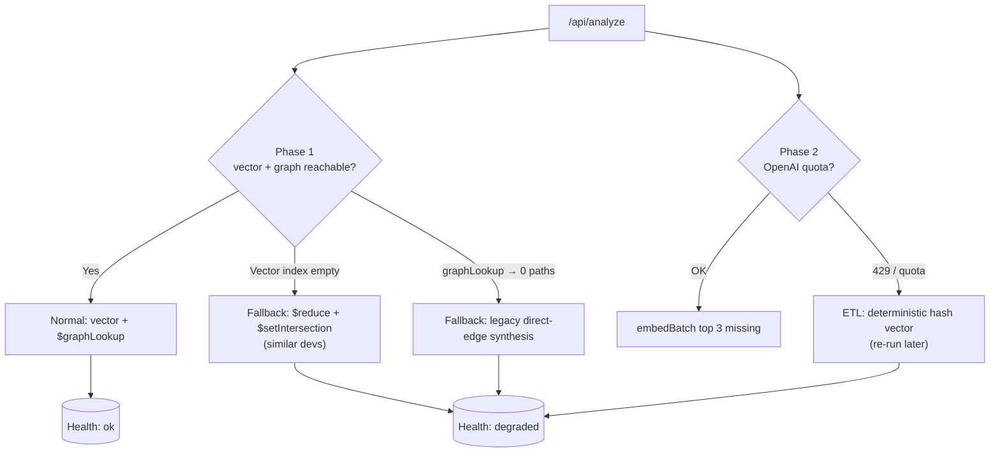

### 10.4 Bảo mật

- `secureHeaders` (Hono middleware) — `Content-Security-Policy`, `X-Content-Type-Options`, `Referrer-Policy`, `Permissions-Policy`.
- CORS whitelist qua `CORS_ORIGINS`.
- Zod validate cả request body lẫn response, từ chối input không hợp lệ tại biên.
- OpenAI key chỉ ở server, không leak xuống client.
- Orchestrator stateless: không persist CV → giảm risk privacy.
- Compress chỉ bật ở production để tránh BREACH attack vector ở dev.

> Note: `users` collection và TTL session vẫn ở dạng schema dự kiến — runtime hiện không persist CV của user, do đó không cần TTL job ở giai đoạn này.

### 10.5 Giới hạn hiện tại

| Giới hạn | Tác động |
|---|---|
| Trajectory là synthetic | Phải ghi rõ `source: synthetic_vn` trong UI |
| `snapshots.cv_embedding` chưa được populate đầy đủ | Similar devs đang chạy fallback aggregation |
| `users` collection chưa được orchestrator dùng | Không có session persistence runtime; profile chỉ tồn tại trong memory của request |
| `RATE_LIMIT_PER_MINUTE` mới khai báo trong env, chưa có middleware enforce | Cần thêm middleware khi mở public |

---

## 11. Quyết định kỹ thuật (ADR)

| ADR | Quyết định | Lý do |
|---|---|---|
| ADR-01 | Tách `client/` và `server/` | Deploy độc lập, type contract qua OpenAPI |
| ADR-02 | OpenAI `gpt-4o-mini` + `text-embedding-3-small` | JSON mode, batch embedding, Matryoshka 768 dim |
| ADR-03 | 768-dim embedding | Giảm storage/index footprint 50% so với 1536, vẫn đủ recall |
| ADR-04 | Precompute `skill_transitions` offline | `$graphLookup` runtime nhẹ, không tính BFS động |
| ADR-05 | Synthetic calibrated trajectory | Deterministic, có pivot rõ ràng, dễ kiểm soát |
| ADR-06 | Provenance gắn vào dữ liệu và UI | Tránh recommendation mập mờ, hỗ trợ Honest Mode |
| ADR-07 | Hono + Zod OpenAPI | Một nguồn cho validation, docs, type shape |
| ADR-08 | Role normalizer | Chặn mismatch giữa title tự do của LLM và label dataset |
| ADR-09 | `@xyflow/react` cho trajectory graph | Sẵn pan/zoom/minimap, custom node/edge |
| ADR-10 | Orchestrator stateless | Scale horizontal, giảm rủi ro privacy |
| ADR-11 | Hybrid Search cho course bằng RRF | Áp dụng pattern chính thức: `$vectorSearch` ⊕ `$search` qua `$unionWith` + Reciprocal Rank Fusion. Bỏ heuristic exact/token tự xây |
| ADR-12 | `$facet` cho proof drawer + salary band | 1 round-trip thay vì 4 query |
| ADR-13 | Skill explain trả về pipeline thật | Radical transparency cho judge audit |
| ADR-14 | Atlas Search `$search` thay `$regex` ở salary band | BM25 ranking, tokenization, có fallback regex khi index thiếu |

---

## 12. Cấu trúc repository

```text
pathfinder/
├── README.md
├── docs/
│   └── TECHNICAL_DOC.md
├── client/
│   └── src/
│       ├── app/(auth)/                  # Sign-in / sign-up / forgot password
│       ├── app/(dashboard)/pathfinder/  # Trang chính
│       │   └── components/              # Cards: gap, paths, graph, proof, salary, courses, …
│       ├── components/                  # Layout, header, theme switcher
│       ├── contexts/                    # i18n VI/EN, theme
│       ├── i18n/locales/
│       └── lib/pathfinder/
│           ├── api.ts                   # Typed fetch client
│           ├── benchmark.ts
│           └── types.ts                 # Mirror schema từ server
└── server/
    ├── src/
    │   ├── config/                      # env, mongo, dns
    │   ├── routes/                      # health, skills, paths, proof, similar, courses, orchestrator, skill-explain
    │   ├── services/
    │   │   ├── aggregations/            # gap, pivot-path, proof-drawer, salary-band, salary-inference, skill-explain
    │   │   ├── vector-search/           # skills, courses, similar-devs
    │   │   └── openai.ts
    │   ├── schemas/                     # Zod + OpenAPI
    │   ├── middleware/
    │   └── lib/                         # role-normalizer, errors, logger
    └── etl/
        ├── 01_generate_trajectories.py
        ├── 02_scrape_itviec.py
        ├── 03_load_skills_roadmap.py
        ├── 04_load_courses.py
        ├── 05_embed_all.py
        ├── 06_create_indexes.py
        ├── 07_compute_transitions.py
        └── README.md
```

File quan trọng nhất khi đọc hệ thống:

- `server/src/routes/orchestrator.ts` — pipeline chính.
- `server/src/services/vector-search/skills.ts` — Vector Search + transition $lookup.
- `server/src/services/aggregations/pivot-path.ts` — `$graphLookup`.
- `server/src/services/aggregations/proof-drawer.ts` — `$facet`.
- `server/src/services/aggregations/skill-explain.ts` — pipeline transparency.
- `server/etl/07_compute_transitions.py` — `$out` + `$concatArrays` build graph.
- `server/etl/06_create_indexes.py` — vector index strategy.

---

## 13. Phụ lục

### 13.1 Environment variables

#### `server/.env`

```env
NODE_ENV=development
PORT=4000
LOG_LEVEL=info

MONGODB_URI=mongodb+srv://...
MONGODB_DB=pathfinder

OPENAI_API_KEY=...
OPENAI_EMBEDDING_MODEL=text-embedding-3-small
OPENAI_LLM_MODEL=gpt-4o-mini

CORS_ORIGINS=http://localhost:3000

VECTOR_INDEX_SKILLS=vec_skills_desc
VECTOR_INDEX_COURSES=vec_courses_desc
VECTOR_INDEX_JOBS=vec_jobs_desc
VECTOR_INDEX_TRAJECTORIES=vec_trajectory_snapshot

# Atlas Search (Lucene full-text) — overrides for $search index names
SEARCH_INDEX_JOBS=jobs_text_search
SEARCH_INDEX_COURSES=courses_text_search

RATE_LIMIT_PER_MINUTE=60
```

#### `client/.env.local`

```env
NEXT_PUBLIC_PATHFINDER_API_URL=http://localhost:4000
```

### 13.2 Ví dụ document `skill_transitions`

```json
{
  "from_skill": "PyTorch",
  "to_skill": "ML Engineer",
  "edge_kind": "skill_to_role",
  "from_node_type": "skill",
  "to_node_type": "role",
  "source_roles": ["Backend Developer", "Data Scientist"],
  "target_roles": ["ML Engineer"],
  "frequency": 124,
  "avg_months": 11.2,
  "median_months": 11.2,
  "avg_salary_lift_pct": 0.28,
  "role_change_rate": 1,
  "sample_size": 124,
  "confidence": "high",
  "computed_at": "2026-05-17T03:21:09Z",
  "source_years": [2023, 2024]
}
```

### 13.3 Định nghĩa Atlas Vector Search index

```json
{
  "name": "vec_skills_desc",
  "type": "vectorSearch",
  "fields": [
    { "type": "vector", "path": "description_embedding", "numDimensions": 768, "similarity": "cosine" },
    { "type": "filter", "path": "category" },
    { "type": "filter", "path": "is_emerging" }
  ]
}
```

Định nghĩa Atlas Search (full-text) index:

```json
{
  "name": "jobs_text_search",
  "type": "search",
  "mappings": {
    "dynamic": false,
    "fields": {
      "title":            { "type": "string", "analyzer": "lucene.standard" },
      "required_skills":  { "type": "string", "analyzer": "lucene.keyword" },
      "description":      { "type": "string", "analyzer": "lucene.standard" },
      "company":          { "type": "string", "analyzer": "lucene.keyword" },
      "level":            { "type": "string", "analyzer": "lucene.keyword" },
      "location":         { "type": "string", "analyzer": "lucene.keyword" }
    }
  }
}
```

### 13.4 Ví dụ payload `MissingSkill`

```json
{
  "name": "LangChain",
  "category": "framework",
  "description": "Framework để xây dựng LLM-powered applications, RAG, và agent workflows.",
  "similarity": 0.88,
  "vn_demand_score": 0.74,
  "transition": {
    "avg_months": 9.5,
    "avg_salary_lift_pct": 32,
    "frequency": 64
  }
}
```

---

**End of Technical Document v3.1**
