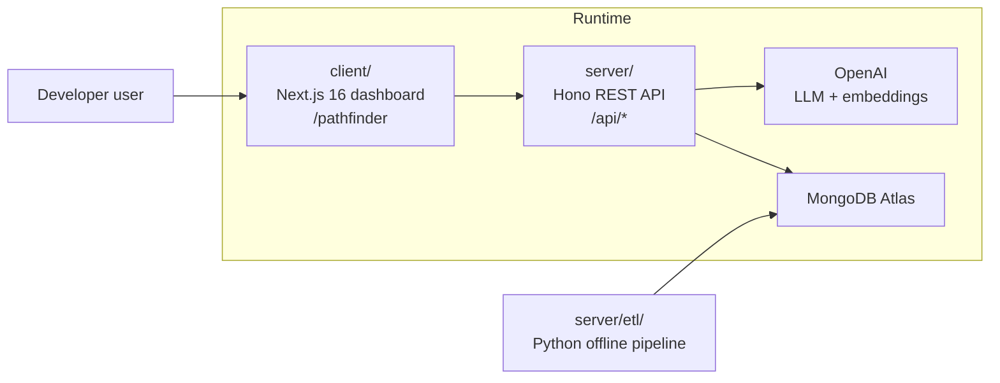
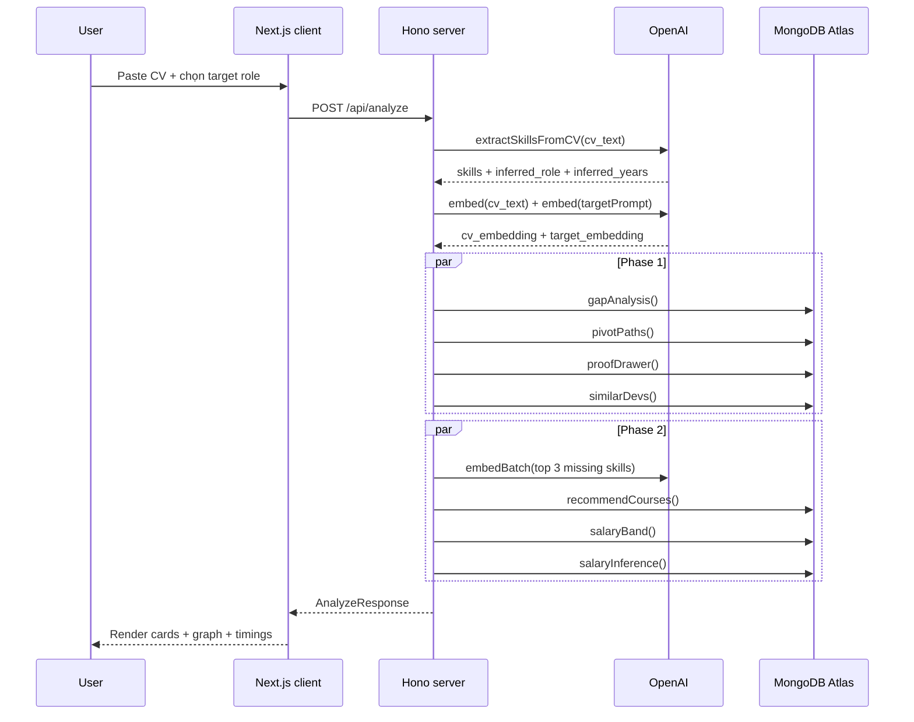
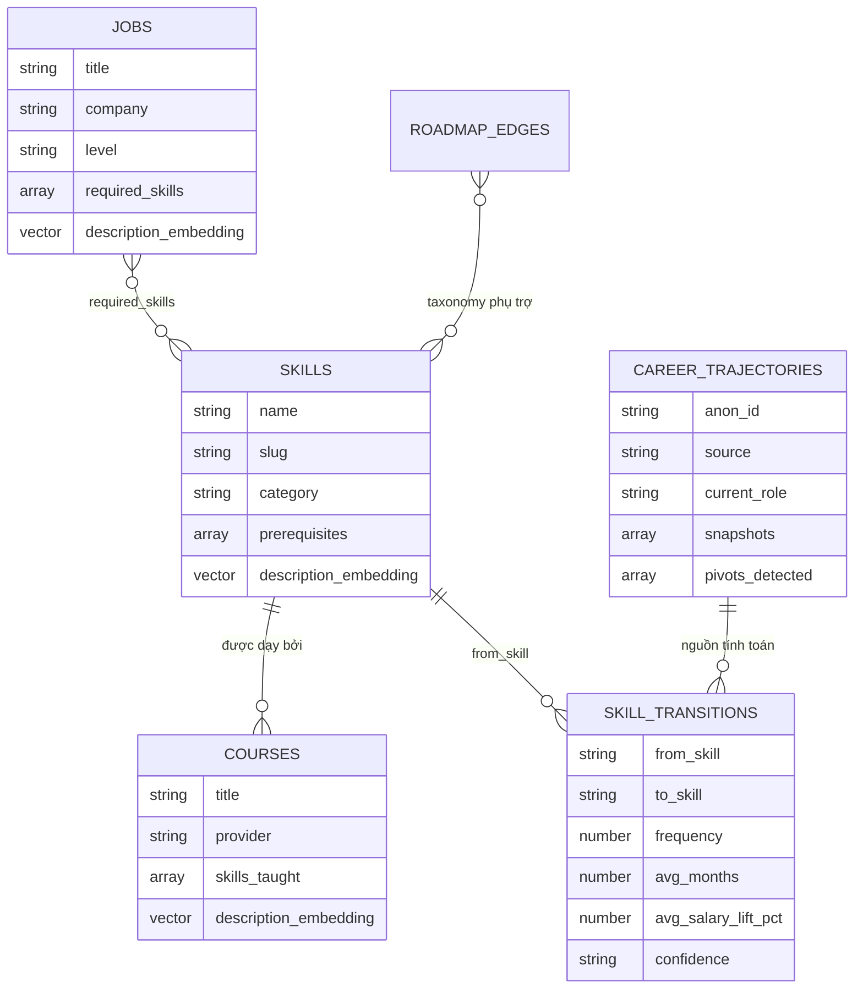

# PathFinder - Tài liệu Kỹ thuật

> Career Pivot Engine cho developer Việt Nam, được xây trên MongoDB Atlas Vector Search, Aggregation Pipeline và OpenAI.

| | |
|---|---|
| **Dự án** | PathFinder |
| **Đội thi** | 100M Builder |
| **Tác giả** | Hoàng Trọng Trà |
| **Cuộc thi** | MUGVN x MongoDB Mini Hackathon 2026 |
| **Phiên bản tài liệu** | 2.0 - implementation snapshot |
| **Cập nhật gần nhất** | 17/05/2026 |
| **Trạng thái code** | MVP đã có luồng end-to-end `CV -> analyze -> dashboard` |
| **Kiến trúc** | Monorepo 2 service: `client/` + `server/` |

---

## Mục lục

1. [Tổng quan giải pháp](#1-tổng-quan-giải-pháp)
2. [Kiến trúc hệ thống](#2-kiến-trúc-hệ-thống)
3. [Luồng runtime](#3-luồng-runtime)
4. [Thiết kế dữ liệu MongoDB](#4-thiết-kế-dữ-liệu-mongodb)
5. [Vector Search và Aggregation Pipeline](#5-vector-search-và-aggregation-pipeline)
6. [API contract](#6-api-contract)
7. [Frontend implementation](#7-frontend-implementation)
8. [ETL, index và reproducibility](#8-etl-index-và-reproducibility)
9. [Hiệu năng, độ tin cậy và giới hạn hiện tại](#9-hiệu-năng-độ-tin-cậy-và-giới-hạn-hiện-tại)
10. [ADR và quyết định kỹ thuật](#10-adr-và-quyết-định-kỹ-thuật)
11. [Cấu trúc repository](#11-cấu-trúc-repository)
12. [Phụ lục](#12-phụ-lục)

---

## 1. Tổng quan giải pháp

### 1.1 Bài toán

PathFinder trả lời ba câu hỏi chính cho developer muốn đổi hướng nghề nghiệp:

| Câu hỏi | Câu trả lời của hệ thống | Kỹ thuật chính |
|---|---|---|
| Tôi còn thiếu skill gì để vào role mục tiêu? | Xếp hạng kỹ năng còn thiếu dựa trên evidence và semantic similarity | Atlas Vector Search + `$lookup` |
| Tôi nên học theo lộ trình nào? | Sinh tối đa 3 path: `fast`, `balanced`, `comprehensive` | `$graphLookup` trên graph `role -> skill -> skill -> role` |
| Có bằng chứng nào cho recommendation này không? | Hiển thị sample size, conversion, salary lift và profile ví dụ | `$facet` trên `career_trajectories` |

### 1.2 Điểm khác biệt

- Recommendation không chỉ là text từ LLM. LLM chỉ dùng để trích skill từ CV.
- Recommendation chính đi qua MongoDB, với dữ liệu có provenance rõ ràng.
- UI có **Honest Mode**:
  - `N >= 30`: hiển thị như recommendation đáng tin.
  - `10 <= N < 30`: hiển thị cảnh báo low confidence.
  - `N < 10`: ẩn card và thay bằng placeholder "not enough data".
- Tài liệu và UI luôn phân biệt dữ liệu:
  - `synthetic_vn` cho trajectory cohort mô phỏng có cân chỉnh.
  - `itviec_sample` cho job salary sample.
  - `roadmap.sh`, `skill_transitions`, `learn.mongodb.com` cho các nguồn phụ trợ.

### 1.3 Phạm vi MVP đang có trong code

| Nhóm | Trạng thái |
|---|---|
| Paste CV và chọn target role | Đã có |
| 3 demo persona | Đã có |
| LLM skill extraction | Đã có |
| Gap analysis | Đã có |
| Pivot path recommendation | Đã có |
| Trajectory graph | Đã có |
| Proof drawer | Đã có |
| Similar developers | Đã có |
| VN salary band | Đã có |
| Course recommendation | Đã có |
| Honest Mode | Đã có |
| User account / persistence | Chưa triển khai |

---

## 2. Kiến trúc hệ thống

### 2.1 Stack hiện tại

| Layer | Công nghệ thực tế trong repo |
|---|---|
| Frontend | Next.js `16.1.1`, React `19.2.3`, TypeScript, Tailwind CSS 4, shadcn/ui |
| Graph UI | `@xyflow/react` `12.10.2` |
| Backend | Hono `4.12.x`, Node.js `>=20.12`, TypeScript |
| Validation + OpenAPI | Zod 4 + `@hono/zod-openapi` + `@hono/swagger-ui` |
| Database | MongoDB Atlas |
| AI | OpenAI `gpt-4o-mini` + `text-embedding-3-small` |
| Embedding shape | 768 chiều bằng tham số `dimensions=768` |
| ETL | Python 3.11 + `pymongo` |
| Logging | `pino` |

### 2.2 Kiến trúc service



### 2.3 Backend runtime

Entry point: `server/src/index.ts`

Global middleware đang dùng:

- `requestId`
- `timing`
- `secureHeaders`
- `compress` trong production
- `cors`
- structured request logging

Không có middleware rate limit runtime trong code hiện tại, dù biến môi trường `RATE_LIMIT_PER_MINUTE` đã được khai báo để dành cho mở rộng sau.

### 2.4 Tách trách nhiệm

| Thành phần | Trách nhiệm |
|---|---|
| `client/` | Form nhập liệu, render dashboard, graph, badge, i18n, state phía browser |
| `server/src/routes/` | API public và OpenAPI contract |
| `server/src/services/openai.ts` | Skill extraction và embedding |
| `server/src/services/vector-search/` | Gap analysis, similar devs, course recommendation |
| `server/src/services/aggregations/` | Pivot path, proof drawer, salary band, salary inference |
| `server/etl/` | Seed dữ liệu, embedding offline, index creation, precompute transitions |

---

## 3. Luồng runtime

### 3.1 Luồng `POST /api/analyze`



### 3.2 Các bước chi tiết trong orchestrator

File: `server/src/routes/orchestrator.ts`

1. Validate `cv_text` và `target_role`.
2. Dùng `gpt-4o-mini` để trích:
   - `skills`
   - `inferred_role`
   - `inferred_years`
3. Tạo embedding:
   - CV text
   - target prompt giàu ngữ cảnh role
4. Chọn start skill theo thứ tự:
   - level cao hơn
   - số năm kinh nghiệm nhiều hơn
5. Chuẩn hóa role bằng `role-normalizer.ts` để khớp canonical role của dataset.
6. Chạy song song Phase 1:
   - gap analysis
   - pivot paths
   - proof drawer
   - similar devs
7. Lấy top 3 missing skills rồi chạy song song Phase 2:
   - course recommendations
   - salary band
   - salary inference
8. Trả một payload duy nhất cho frontend, kèm `timings_ms`.

### 3.3 Canonical role normalization

Dataset trajectory chỉ dùng 10 role canonical:

- `Frontend Developer`
- `Backend Developer`
- `Full-stack Developer`
- `Mobile Developer`
- `Data Engineer`
- `Data Scientist`
- `ML Engineer`
- `AI Engineer`
- `DevOps Engineer`
- `Cloud Engineer`

`role-normalizer.ts` map free-form title từ LLM sang các role này bằng:

1. exact match
2. regex theo title
3. weighted vote theo skill stack
4. fallback mặc định về `Backend Developer`

Mục tiêu là tránh tình trạng LLM trả về title như `Tech Lead` hoặc `Senior Software Engineer` khiến aggregation match ra 0 dòng.

---

## 4. Thiết kế dữ liệu MongoDB

### 4.1 Collections thực tế

| Collection | Vai trò | Runtime hiện tại |
|---|---|---|
| `skills` | Taxonomy skill + embedding | Có |
| `courses` | Course catalog + embedding | Có |
| `jobs` | JD/salary sample Việt Nam | Có |
| `career_trajectories` | Cohort trajectory + pivot events | Có |
| `skill_transitions` | Graph edge đã precompute từ trajectory | Có |
| `roadmap_edges` | Cạnh roadmap từ roadmap.sh | ETL phụ trợ, chưa dùng runtime |
| `users` | Schema/index cho session TTL | Đã khai báo, runtime hiện chưa ghi |

Điểm quan trọng: orchestrator hiện là **stateless**. Nó không persist CV của user vào MongoDB trong luồng `/api/analyze`.

### 4.2 Quan hệ dữ liệu



### 4.3 Schema chính

#### `skills`

- `name`
- `slug`
- `category`
- `description`
- `description_embedding`
- `prerequisites`
- `related_skills`
- `popularity_rank`
- `is_emerging`
- `vn_demand_score`

#### `courses`

- `title`
- `provider`
- `url`
- `price_usd`
- `duration_hours`
- `level`
- `skills_taught`
- `description`
- `description_embedding`
- `rating`
- `enrollment_count`
- `is_mongodb_official`

#### `jobs`

- `source`
- `title`
- `company`
- `location`
- `level`
- `salary_min`
- `salary_max`
- `salary_currency`
- `required_skills`
- `nice_to_have`
- `description`
- `description_embedding`

#### `career_trajectories`

- `anon_id`
- `source`
- `country`
- `current_role`
- `total_years_exp`
- `comp_total_usd`
- `snapshots[]`
- `pivots_detected[]`

#### `skill_transitions`

- `from_skill`
- `to_skill`
- `frequency`
- `avg_months`
- `median_months`
- `avg_salary_lift_pct`
- `role_change_rate`
- `sample_size`
- `confidence`
- `computed_at`
- `source_years`

### 4.4 Vì sao dùng MongoDB

| Nhu cầu | Lợi ích của MongoDB |
|---|---|
| Snapshot career có độ dài khác nhau | Embedded arrays tự nhiên hơn mô hình bảng |
| Metadata và vector nằm cùng document | Không cần tách sang vector DB riêng |
| Recommendation cần join và analytics | Có `$lookup`, `$facet`, `$group`, `$graphLookup` |
| Taxonomy và dữ liệu roadmap thay đổi theo thời gian | Schema linh hoạt |
| Runtime cần filter trước khi vector search | Atlas Vector Search hỗ trợ filter |

---

## 5. Vector Search và Aggregation Pipeline

### 5.1 Gap analysis

File: `server/src/services/vector-search/skills.ts`

Hệ thống dùng hai đường retrieval song song:

1. **Evidence-first**
   - query `skill_transitions` theo `to_skill = target_role`
   - sort theo `frequency`, `avg_salary_lift_pct`
   - `$lookup` sang `skills`
2. **Semantic fallback**
   - `$vectorSearch` trên `skills.description_embedding`
   - filter theo category
   - loại bỏ tên node rác từ taxonomy scrape
   - `$lookup` thêm transition info

Sau đó merge theo tên skill, ưu tiên evidence row trước semantic row.

Kết quả trả về:

- `name`
- `category`
- `description`
- `similarity`
- `vn_demand_score`
- `transition`

### 5.2 Course recommendation

File: `server/src/services/vector-search/courses.ts`

Luồng:

1. Embed top 3 missing skills bằng `embedBatch`.
2. `$vectorSearch` trên `courses.description_embedding`.
3. Pre-filter:
   - course chính thức của MongoDB
   - hoặc free
   - hoặc giá `<= 50 USD`
4. Tính `exact_match`, `token_match`, rồi sort:
   - exact match giảm dần
   - token match giảm dần
   - similarity giảm dần

Đây là hybrid ranking, không phải chỉ semantic search thuần túy.

### 5.3 Similar developers

File: `server/src/services/vector-search/similar-devs.ts`

Có hai đường chạy:

1. **Primary**
   - `$vectorSearch` trên `snapshots.cv_embedding`
2. **Fallback hiện đang được dùng với synthetic seed**
   - `$reduce` để flatten toàn bộ `snapshots.skills_have`
   - `$setIntersection` để tính overlap
   - `$group` theo `current_role`

ETL seed hiện tại không populate `snapshots.cv_embedding`, nên hệ thống tự động rơi về aggregation fallback cho use case này.

### 5.4 Pivot paths

File: `server/src/services/aggregations/pivot-path.ts`

Luồng hiện tại:

1. ETL biến mỗi pivot thành chuỗi thật:
   - `from_role -> skill_1 -> skill_2 -> ... -> to_role`
2. Runtime bắt đầu từ canonical `start_role`.
3. `$graphLookup` lấy toàn bộ reachable subgraph trong giới hạn depth và chỉ đi qua edge có cùng `target_roles`.
4. Service dựng candidate paths từ graph và chọn 3 flavor:
   - `fast`: ít tháng nhất
   - `balanced`: lift-per-month có trọng số support
   - `comprehensive`: đường dài hơn, support/confidence tốt hơn
5. Nếu DB cũ chưa được rerun ETL và chỉ còn edge legacy `skill -> role`, service mới fallback về synthesis cũ để API không bị tối.

### 5.5 Proof drawer

File: `server/src/services/aggregations/proof-drawer.ts`

Một `$facet` trả về trong một round-trip:

- `sample_size`
- `conversion`
- `salary_stats`
- `examples`
- `sources`

Cách tính:

- Mẫu số conversion = mọi trajectory từng đi qua `from_role`
- Tử số conversion = trajectory có `current_role === to_role`
- Confidence backend:
  - `high` nếu `N >= 100`
  - `medium` nếu `N >= 30`
  - `low` nếu thấp hơn

Frontend vẫn áp dụng Honest Mode chặt hơn theo ngưỡng render card.

### 5.6 Salary band

File: `server/src/services/aggregations/salary-band.ts`

Nguồn: `jobs`

Match bằng:

- regex title alias theo role
- hoặc overlap với top missing skills

Một `$facet` trả về:

- `by_level`
- `top_companies`
- `top_skills`
- `overall`

### 5.7 Salary inference

File: `server/src/services/aggregations/salary-inference.ts`

Luồng:

- `$unwind` `pivots_detected`
- `$match` pivots chứa toàn bộ `skills_learned`
- `$group` theo `to_role`
- trả `sample_size`, `avg_months`, `median_lift_pct`

Lưu ý: trường tên là `median_lift_pct`, nhưng code hiện dùng `$avg` làm xấp xỉ.

---

## 6. API contract

### 6.1 Endpoint list

| Method | Path | Chức năng |
|---|---|---|
| `GET` | `/health` | Kiểm tra MongoDB + OpenAI |
| `GET` | `/docs` | Swagger UI |
| `GET` | `/openapi.json` | OpenAPI spec |
| `POST` | `/api/extract-skills` | Parse CV bằng LLM |
| `POST` | `/api/embed` | Tạo embedding 768 chiều |
| `POST` | `/api/gap-analysis` | Phân tích skill gap |
| `POST` | `/api/pivot-paths` | Sinh path |
| `POST` | `/api/proof-drawer` | Trả evidence |
| `POST` | `/api/similar-devs` | Nhóm developer tương tự |
| `POST` | `/api/course-recommendations` | Gợi ý course |
| `POST` | `/api/analyze` | Orchestrator end-to-end |

### 6.2 `POST /api/analyze`

Request:

```json
{
  "cv_text": "string, 50..8000 chars",
  "target_role": "AI Engineer"
}
```

Response cấp cao:

```json
{
  "profile": {},
  "gap_analysis": {},
  "pivot_paths": {},
  "proof_drawer": {},
  "similar_devs": {},
  "courses_by_skill": [],
  "salary_band": {},
  "pivot_salary_lift": [],
  "timings_ms": {}
}
```

Schema backend đặt tại:

- `server/src/schemas/api.ts`
- `server/src/schemas/*.ts`

Frontend giữ type mirror thủ công tại:

- `client/src/lib/pathfinder/types.ts`

### 6.3 Error handling

Server dùng envelope chuẩn:

```json
{
  "error": {
    "code": "string",
    "message": "string",
    "details": {}
  }
}
```

Frontend map lỗi này qua `PathFinderApiError`.

---

## 7. Frontend implementation

### 7.1 Entry point

- Route dashboard: `client/src/app/(dashboard)/pathfinder/page.tsx`
- Core container: `PathFinderAnalyzer`
- API client: `client/src/lib/pathfinder/api.ts`

Biến môi trường frontend thực tế:

```env
NEXT_PUBLIC_PATHFINDER_API_URL=http://localhost:4000
```

Nếu không khai báo, client fallback về `http://localhost:4000`.

### 7.2 Form flow

`AnalyzeForm` hỗ trợ:

- paste CV
- 3 demo personas
- free text target role
- dropdown 12 role preset
- validate CV `50..8000` ký tự

### 7.3 Result cards

`AnalysisResults` render:

1. Profile card
2. Gap analysis
3. Pivot paths
4. Trajectory graph
5. Proof drawer
6. Similar devs
7. Salary band
8. Courses
9. Timings

### 7.4 Trajectory graph

File: `trajectory-graph-card.tsx`

- Dùng `@xyflow/react`
- Có 3 lane: `fast`, `balanced`, `comprehensive`
- Có edge labels:
  - tháng học
  - salary lift
- Có pan, controls, minimap khi graph đủ lớn

### 7.5 Honest Mode

File: `honest-mode.tsx`

Ngưỡng render thực tế:

| N | UI |
|---|---|
| `N >= 30` | trustworthy |
| `10 <= N < 30` | low confidence |
| `N < 10` | insufficient data placeholder |

Card còn hiển thị data source badge và aggregation stage badge để người xem thấy recommendation dựa trên kỹ thuật nào.

---

## 8. ETL, index và reproducibility

### 8.1 Pipeline ETL

Nguồn: `server/etl/README.md`

| Bước | Script | Output |
|---|---|---|
| 1 | `01_generate_trajectories.py` | khoảng 3000 synthetic trajectory |
| 2 | `02_scrape_itviec.py` | khoảng 20 job rows curated |
| 3 | `03_load_skills_roadmap.py` | `skills` + `roadmap_edges` |
| 4 | `04_load_courses.py` | khoảng 30 courses |
| 5 | `05_embed_all.py` | embedding 768 chiều |
| 6 | `06_create_indexes.py` | regular index + vector index |
| 7 | `07_compute_transitions.py` | graph `skill_transitions` bằng `$out` |

### 8.2 Dữ liệu synthetic

`01_generate_trajectories.py` tạo cohort có:

- seed cố định `42`
- explicit pivot events
- role mix và salary band được cân chỉnh theo market signal
- mục tiêu chính là deterministic demo và pipeline correctness

Đây không phải dữ liệu người dùng thật. Tài liệu và UI phải tiếp tục ghi rõ provenance này.

### 8.3 Embedding pipeline

`05_embed_all.py`:

- dùng `text-embedding-3-small`
- ép chiều về `768`
- có fallback deterministic hash vector khi quota/rate-limit lỗi

Fallback hash chỉ giữ đúng shape index, không có semantic meaning thật. Nếu dùng fallback trong quá trình seed, cần rerun step 5 khi quota OpenAI ổn định để thay bằng embedding thật.

### 8.4 Index strategy

Regular index đáng chú ý:

- `skills.name` unique
- `jobs.required_skills`
- `jobs(level, location)`
- `career_trajectories(country, total_years_exp)`
- `career_trajectories.current_role`
- `career_trajectories.snapshots.skills_have`
- `skill_transitions(from_skill, to_skill)` unique
- `roadmap_edges(roadmap_slug, source_node_id)`
- `users.ttl_expires_at`

Vector index definitions:

| Index | Collection | Vector path | Runtime hiện tại |
|---|---|---|---|
| `vec_skills_desc` | `skills` | `description_embedding` | Có |
| `vec_courses_desc` | `courses` | `description_embedding` | Có |
| `vec_trajectory_snapshot` | `career_trajectories` | `snapshots.cv_embedding` | Có đường chạy, seed hiện rơi về fallback |
| `vec_jobs_desc` | `jobs` | `description_embedding` | Đã định nghĩa, chưa là đường runtime chính |

Trên Atlas M0/M2/M5, giới hạn index khiến script ưu tiên tạo:

1. skills
2. courses
3. trajectories
4. jobs

### 8.5 Chạy lại local

```bash
# server
cd server
npm install
npm run etl:install
npm run etl:all
npm run dev

# client
cd ../client
npm install
npm run dev
```

URL local:

- frontend: `http://localhost:3000/pathfinder`
- backend: `http://localhost:4000`
- Swagger UI: `http://localhost:4000/docs`

---

## 9. Hiệu năng, độ tin cậy và giới hạn hiện tại

### 9.1 Mục tiêu thiết kế

| Hạng mục | Mục tiêu |
|---|---|
| Vector search top-K | `< 800 ms` |
| Full `/api/analyze` | `< 4 s` P95 |
| Server connection pool | `maxPoolSize = 5` |
| Embedding dimension | `768` |

Các con số trên là **target kỹ thuật**, chưa phải benchmark được commit vào repo.

### 9.2 Tối ưu hiện có

- `Promise.all` theo 2 phase để giảm tổng latency.
- `skill_transitions` precompute offline thay vì tính runtime.
- Rich target prompts giúp target embedding bám đúng stack hơn bare title.
- `embedBatch` cho top missing skills.
- Vector search có pre-filter.
- Runtime server stateless.

### 9.3 Giới hạn hiện tại

| Giới hạn | Tác động |
|---|---|
| Trajectory seed là synthetic | Không được trình bày như dữ liệu người dùng thật |
| `snapshots.cv_embedding` chưa có trong seed hiện tại | Similar devs chủ yếu dùng fallback aggregation |
| `median_lift_pct` đang tính bằng `$avg` | Tên trường chưa phản ánh đúng statistic tuyệt đối |
| `users` collection chưa được orchestrator dùng | Không có session persistence runtime |
| Chưa thấy test files được commit | Cần bổ sung coverage khi ổn định API |

---

## 10. ADR và quyết định kỹ thuật

| ADR | Quyết định | Lý do |
|---|---|---|
| ADR-01 | Tách `client/` và `server/` | Deploy độc lập, trách nhiệm rõ |
| ADR-02 | Chọn OpenAI thay vì Gemini | Code hiện tại đã chuẩn hóa quanh OpenAI SDK, JSON mode và embedding pipeline |
| ADR-03 | Dùng 768-dim embedding | Giảm storage/index footprint nhưng vẫn giữ chất lượng đủ cho MVP |
| ADR-04 | Precompute `skill_transitions` offline | Giảm latency runtime |
| ADR-05 | Dùng synthetic calibrated trajectory | Deterministic, explicit pivots, dễ demo và kiểm soát |
| ADR-06 | Giữ provenance trên dữ liệu và UI | Tránh recommendation mập mờ |
| ADR-07 | Dùng Hono + Zod OpenAPI | Một nguồn cho validation, docs và type shape |
| ADR-08 | Dùng role normalizer | Chặn mismatch giữa title tự do của LLM và label dataset |
| ADR-09 | Dùng `@xyflow/react` | Có sẵn pan/zoom/minimap và custom node/edge |
| ADR-10 | Orchestrator stateless | Dễ scale và giảm rủi ro privacy |

---

## 11. Cấu trúc repository

```text
pathfinder/
├── README.md
├── docs/
│   ├── PRD.md
│   └── TECHNICAL_DOC.md
├── client/
│   └── src/
│       ├── app/(dashboard)/pathfinder/
│       ├── components/
│       ├── contexts/
│       └── lib/pathfinder/
└── server/
    ├── src/
    │   ├── config/
    │   ├── routes/
    │   ├── services/
    │   │   ├── aggregations/
    │   │   └── vector-search/
    │   ├── schemas/
    │   ├── middleware/
    │   └── lib/
    └── etl/
```

Các file đáng đọc nhất để hiểu hệ thống:

- `server/src/routes/orchestrator.ts`
- `server/src/services/vector-search/skills.ts`
- `server/src/services/aggregations/pivot-path.ts`
- `server/src/services/aggregations/proof-drawer.ts`
- `server/src/services/aggregations/salary-band.ts`
- `client/src/app/(dashboard)/pathfinder/components/analysis-results.tsx`
- `server/etl/README.md`

---

## 12. Phụ lục

### 12.1 Environment variables

#### `server/.env`

```env
NODE_ENV=development
PORT=4000
LOG_LEVEL=info

MONGODB_URI=mongodb+srv://...
MONGODB_DB=pathfinder

OPENAI_API_KEY=...
OPENAI_EMBEDDING_MODEL=text-embedding-3-small
OPENAI_LLM_MODEL=gpt-4o-mini

CORS_ORIGINS=http://localhost:3000

VECTOR_INDEX_SKILLS=vec_skills_desc
VECTOR_INDEX_COURSES=vec_courses_desc
VECTOR_INDEX_JOBS=vec_jobs_desc
VECTOR_INDEX_TRAJECTORIES=vec_trajectory_snapshot
RATE_LIMIT_PER_MINUTE=60
```

#### `client/.env.local`

```env
NEXT_PUBLIC_PATHFINDER_API_URL=http://localhost:4000
```

### 12.2 Ví dụ `skill_transitions`

```json
{
  "from_skill": "PyTorch",
  "to_skill": "ML Engineer",
  "frequency": 124,
  "avg_months": 11.2,
  "median_months": 11.2,
  "avg_salary_lift_pct": 0.28,
  "role_change_rate": 0.5,
  "sample_size": 124,
  "confidence": "high"
}
```

### 12.3 Ví dụ `AnalyzeResponse`

```json
{
  "profile": {
    "skills": [
      { "name": "Java", "level": "advanced", "years": 4 }
    ],
    "inferred_role": "Backend Engineer",
    "inferred_years": 4
  },
  "gap_analysis": {
    "missing_skills": []
  },
  "pivot_paths": {
    "paths": []
  },
  "proof_drawer": {
    "sample_size": 0,
    "conversion_rate": 0,
    "salary_stats": {
      "median_lift_pct": 0,
      "min_lift_pct": 0,
      "max_lift_pct": 0,
      "avg_months": 0
    },
    "example_profiles": [],
    "confidence": "low",
    "data_sources": []
  }
}
```


**End of Technical Document v2.0**
